# Projektdokumentation

---

## Inhaltsverzeichnis

- [Einleitung](#einleitung)
- [Überblick Gesamtarchitektur](#überblick-gesamtarchitektur)
- [Dokumentation des Backends](#dokumentation-des-backends)
- [Dokumentation des Frontends](#dokumentation-des-frontends)
- [Dokumentation der Datengeneration und -aufbereitung](#dokumentation-der-datengrundlage-und--aufbereitung)
- [verwendete Technologien](#verwendete-technologien)
- [Installation und Setup](#installation-und-setup)
- [Nutzerleitfaden](#nutzerleitfaden)
- [Evaluation](#evaluation)
- [Limitationen](#limitationen)
- [Einordnung](#einordnung)
- [Ausblick](#ausblick)
- [Fazit](#fazit)
- [Verantwortlichkeiten im Projekt](#verantwortungsbereiche)


## Einleitung

EchoLearn ist ein interaktiver Prototyp zur Simulation mündlicher Prüfungssituationen zum Thema Data Science.  
Das System stellt Fragen, verarbeitet gesprochene Antworten, bewertet diese automatisiert und generiert je nach Qualität der Antwort adaptive Rück- oder Vertiefungsfragen, um einen prüfungsähnlichen Dialog zu erzeugen.

Das Projekt wurde im universitären Kontext als experimenteller Prototyp entwickelt und dient der konzeptionellen Untersuchung KI-gestützter Bewertung frei gegebener mündlicher Antworten.
  
---

### Motivation & Ziel des Projekts

Die Vorbereitung auf mündliche Prüfungen ist oft eingeschränkt, da sie typischerweise eine zweite Person erfordert und reale Prüfungssituationen nur schwer reproduzierbar sind.

Digitale Lernsysteme bieten häufig nur:

- Multiple-Choice-Tests
- statische Übungsfragen
- nicht-interaktive Lernmaterialien

Das Ziel des Projekts besteht daher darin zu untersuchen, inwiefern durch Speach-To-Text (STT) mündlich gegebene Antworten von Lernenden korrekt transkripiert und im Anschluss mit Hilfe von Large Language Modells (LLMs) mit einer vordefinierten Antwort aus einem Datensatz abgeglichen und sowohl eine textuelle als auch eine quantitative Bewertung generiert werden kann, welche den Lernenden dabei hilft, sich besser auf mündliche Prüfungen und Klausuren vorzubereiten.

Hierfür wurden im Projekt folgende Leitfragen untersucht:
1. Kann ein LLM die Generierung einer Klassifizierung von Fragetypen sowie maximal zu erreichenden Punkten inklusive Übersetzung von Antworten und Fragen aus dem Englischen ins Deutsche zuverlässig übernehmen?
2. Ist die Transkripitonsqualität des STT ausreichend, um darauf aufbauend automatisierte Bewertungen durch ein LLM erzeugen zu lassen?
3. Ist ein LLM als automatischer Bewerter und Feedbackgeber in der Lage den Lernprozess zu unterstützen? 
4. Wie robust ist die Bewertung des LLM trotz Transkriptionsfehlern oder sprachlichen Unschärfen?

---

### Ursprüngliche Pitch Beschreibung

Die Idee ist eine KI-gestützte Lernplattform zur ganzheitlichen Vorbereitung auf mündliche Prüfungen. Ziel ist es, nicht nur Wissen aufzubauen, sondern die tatsächliche Prüfungssituation realitätsnah zu trainieren.

Im Zentrum steht eine intelligente Prüfungssimulation, wobei die KI die Rolle der prüfenden Person übernimmt, fachliche Fragen stellt, dynamisch auf Antworten reagiert und durch gezielte Rückfragen zu präziserem Denken und Argumentieren herausfordert, ähnlich wie in einer echten mündlichen Prüfung. Im Anschluss erfolgt eine differenzierte Bewertung der Leistung mit individuellem Feedback zu Inhalt, Argumentationsstruktur, sprachlicher Klarheit und Prüfungskompetenz.

Ergänzend dazu umfasst das Konzept einen Trainingsbereich, der auf lernpsychologischen Prinzipien wie Active Recall und Spaced Repetition basiert. Inhalte werden aktiv abgefragt, wiederholt und langfristig gefestigt. Dabei erfolgt die Interaktion sowohl schriftlich als auch mündlich: Lernende erklären Inhalte laut, beantworten Fragen verbal und trainieren so neben Fachwissen auch ihre Ausdrucksfähigkeit und spontane Reaktionskompetenz.

Die Vision: Eine Plattform, die Wissensaufbau, Anwendung und Performanztraining verbindet – damit Lernende nicht nur wissen, was richtig ist, sondern es auch souverän und strukturiert ausdrücken können.

---

### Projektansatz

Um das Ziel des Projekts zu erreichen, wurde mit "EchoLearn" ein Prüfungssimulator entwickelt, der den Ansatz verfolgt, einen adaptiven Prüfungsdialog zu simulieren, auf offene Antworten zu reagiert und gezielte Rückfragen zu stellen, um anschließend durch spezifisches Feedback eine kontinuierliche Verbesserung des Wissensstandes von Lernenden zu ermöglichen.
Im Prototyp enthält die Prüfung zum Testen lediglich 3 Fragen. Zum Einsatz zur Prüfungsvorbereitung empfehlen wir 7 bis 10 Fragen, um einen Übungseffekt zu erzielen und sich der Dauer einer realen mündlichen Prüfung anzunäher.
Es wurden Prüfungen simuliert, eine automatische textuale sowie quantitative Bewertung durch verschiedene LLMs erzeugt und diese mit einer Referenzbewertung, welche durch die Projektmitglieder vergeben wurde, verglichen, um eine Evaluation durchführen zu und so die zentralen Fragestellungen des Projekts beantworten zu können.
"EchoLearn" fokusiert sich auf Grund des begrenzten zeitlichen Projektrahmens auf die Erstellung eines Prototypen, um eine grobe Einschätzung einer möglichen Umsetzung der Projektidee zu erhalten. Es wurde daher bewusst auf eine Laufzeitanalyse, sowie auf die Integration innerhalb eines Lernmanagementsystems verzichtet und lediglich mit einem begrenzten Evaluationsdatensatz gearbeitet. Auch auf eine Analyse der Qualität der generierten Ergänzungsfragen sowie Vertiefungsfragen bewusst verzichtet und lediglich die grundsätzliche Möglichkeit zur Integration im Prototyp demonstriert.

---

## Überblick Gesamtarchitektur

### Docker-Architektur

Die Anwendung wird lokal über **Docker Compose** ausgeführt und besteht aus drei zentralen Services:

- Backend (API)
- Datenbank
- Frontend

Durch die Containerisierung werden alle benötigten Komponenten in isolierten Umgebungen gestartet und automatisch miteinander verbunden.

---

### Backend Service

Der Backend-Service stellt die zentrale API der Anwendung bereit.
Er wird aus dem lokalen `backend` Verzeichnis gebaut und läuft in einem eigenen Container.

Das Backend übernimmt unter anderem:

- Verarbeitung von API-Anfragen
- Zugriff auf die Datenbank
- Integration der Sprachmodelle zur Bewertung von Antworten
- Bereitstellung der Daten für das Frontend

Der Service ist über folgenden Port erreichbar:

```
http://localhost:8000
```

Die API-Dokumentation wird automatisch von FastAPI generiert und ist unter folgender Adresse verfügbar:

```
http://localhost:8000/docs
```

Die Verbindung zur Datenbank erfolgt über die Umgebungsvariable `DATABASE_URL`.

---

### Datenbank Service

Für die Persistenz der Daten wird eine **PostgreSQL-Datenbank** verwendet.

Der Datenbankcontainer basiert auf dem offiziellen PostgreSQL-Image und wird mit folgenden Parametern initialisiert:

- Datenbankname: `echolearn`
- Benutzer: `echolearn`
- Passwort: `echolearn`

Die Daten werden in einem **Docker-Volume** gespeichert, sodass sie auch nach einem Neustart der Container erhalten bleiben.

```
Volume: db-data
```

Die Datenbank ist lokal über Port `5432` erreichbar.

---

### Frontend Service

Das Frontend basiert auf **Vue 3** und wird innerhalb eines Node.js-Containers ausgeführt.

Beim Start des Containers werden automatisch:

1. die benötigten npm-Abhängigkeiten installiert
2. die Entwicklungsumgebung gestartet

Der Dev-Server wird anschließend auf Port `5173` bereitgestellt.

```
http://localhost:5173
```

Das Frontend kommuniziert mit der Backend-API, um:

- Prüfungsfragen abzurufen
- Antworten zu übermitteln
- Bewertungen und Rückfragen zu erhalten
- Lernstatistiken darzustellen

---

### Service-Abhängigkeiten

Die Services werden in einer definierten Reihenfolge gestartet:

1. Datenbank (`db`)
2. Backend (`backend`)
3. Frontend (`frontend`)

Das Backend benötigt eine aktive Datenbankverbindung, während das Frontend auf das Backend zugreift.

Docker Compose stellt sicher, dass diese Abhängigkeiten berücksichtigt werden.

---

### Persistente Daten

Die Datenbank speichert ihre Daten in einem benannten Docker-Volume:

```
db-data
```

Dieses Volume sorgt dafür, dass Daten auch dann erhalten bleiben, wenn die Container neu gestartet oder neu gebaut werden.

---

### Lokales Entwicklungssetup

Die gesamte Anwendung kann lokal mit Docker Compose gestartet werden.
Alle Services sind anschließend über die jeweiligen Ports erreichbar und bilden gemeinsam die vollständige Entwicklungsumgebung.

---

## Dokumentation des Backends

---

### Backend-Überblick

Das EchoLearn-Backend ist der Teil des Systems, der den Prüfungsablauf im Hintergrund steuert.  
Es verwaltet Fragen, nimmt Antworten entgegen, lässt diese vom LLM bewerten und speichert sowohl Einzelbewertungen als auch das Gesamtfeedback einer Sitzung.

Grob ist der Code in drei Bereiche aufgeteilt:
- `routers/`: Hier kommen HTTP-Anfragen an und werden an die passende Logik weitergegeben.
- `services/`: Hier liegt die eigentliche Fachlogik (z. B. Bewertung und nächste Aktion).
- `models/` + `core/db.py`: Hier ist definiert, wie Daten gespeichert werden.

---

### Aktuelle Ordnerstruktur

- `backend/app/main.py`: Startpunkt der FastAPI-Anwendung, inklusive CORS und Router-Einbindung
- `backend/app/core/`: Basis-Setup wie die Datenbankverbindung (`db.py`)
- `backend/app/models/`: SQLAlchemy-Modelle für die Tabellen
- `backend/app/routers/`: API-Endpunkte
- `backend/app/services/`: LLM-Integration und Prüfungslogik
- `backend/app/seed/`: Seed-Skript zum Neuaufsetzen der Tabellen und Befüllen mit Startdaten
- `backend/app/utils/`: vorhanden, derzeit ohne aktive Nutzung

---

### Aktive Router in `main.py`

Aktuell sind folgende Router aktiv eingebunden:
- `questions.router`
- `exam.router`
- `exam_evaluation_single_answers.router`

---

### Datenbank

- Verbindungs-URL in `backend/app/core/db.py`:
  - `postgresql+asyncpg://echolearn:echolearn@db:5432/echolearn`

- `backend/app/seed/seed_data.py`:
  - setzt die Tabellen neu auf (`drop_all` + `create_all`)
  - lädt Fragen aus `data/processed/questions.csv` in die Datenbank

---

### Modelle

- `Question` (`questions`)
  - `id` (`Integer`, PK)
  - `question` (`Text`, Pflicht)
  - `answer` (`Text`, Pflicht)
  - `max_points` (`Text`, Pflicht)

- `ExamEvaluationSingleAnswer` (`exam_evaluation_single_answer`)
  - `id` (`Integer`, PK)
  - `parent_id` (`Integer`)
  - `unique_exam_id` (`Text`, Pflicht)
  - `question_type` (`Text`, Pflicht)
  - `question` (`Text`, Pflicht)
  - `student_answer` (`Text`, Pflicht)
  - `correct_answer` (`Text`, Pflicht)
  - `feedback` (`Text`, Pflicht)
  - `rating` (`Text`, Pflicht)
  - `max_points` (`Text`, Pflicht)

- `ExamEvaluationFinal` (`exam_evaluation_final`)
  - `id` (`Integer`, PK)
  - `unique_exam_id` (`Text`, Pflicht)
  - `overall_feedback` (`Text`, Pflicht)

---

### LLM-Integration

Die Kommunikation mit dem Modellserver ist zentral in `backend/app/services/llm_handler.py` gekapselt.  
So bleibt die Fachlogik unabhängig von den technischen Details des LLM-Aufrufs.

- Modellserver:
  - `http://catalpa-llm.fernuni-hagen.de:11434/api/generate`

- Standardmodell:
  - `phi4:latest`

- Prompt-Quellen:
  - `backend/app/services/prompts.py`

- Fachliche Orchestrierung:
  - `backend/app/services/exam_simulator.py`

---

### API-Referenz

---

#### Questions (`/questions`)

- <span style="background:#1d4ed8;color:#ffffff;padding:2px 6px;border-radius:4px;font-weight:700;">GET</span> ` /questions/`
  - gibt alle gespeicherten Fragen zurück
  - Eingabeparameter: keine
  - Request-Body: keiner
  - Response (JSON):
    ```json
    [
      {
        "id": 1,
        "question": "Was ist ...?",
        "answer": "Die Antwort ist ...",
        "max_points": "5"
      }
    ]
    ```

- <span style="background:#1d4ed8;color:#ffffff;padding:2px 6px;border-radius:4px;font-weight:700;">GET</span> ` /questions/random`
  - liefert bis zu 7 zufällige Fragen für eine Session
  - Eingabeparameter: keine
  - Request-Body: keiner
  - Response (JSON):
    ```json
    [
      {
        "id": 3,
        "question": "Erkläre ...",
        "answer": "Dabei gilt ...",
        "max_points": "5"
      }
    ]
    ```

- <span style="background:#1d4ed8;color:#ffffff;padding:2px 6px;border-radius:4px;font-weight:700;">GET</span> ` /questions/{question_id}`
  - liefert eine einzelne Frage anhand der ID
  - Eingabeparameter (Path): `question_id: int`
  - Request-Body: keiner
  - Response (JSON):
    ```json
    {
      "id": 1,
      "question": "Was ist ...?",
      "answer": "Die Antwort ist ...",
      "max_points": "5"
    }
    ```
  - `404`, wenn nicht vorhanden

- <span style="background:#16a34a;color:#ffffff;padding:2px 6px;border-radius:4px;font-weight:700;">POST</span> ` /questions/`
  - legt eine neue Frage an
  - Eingabeparameter: keine
  - Body:
    ```json
    {
      "question": "Frage",
      "answer": "Antwort",
      "max_points": "5"
    }
    ```
  - Response (JSON):
    ```json
    {
      "id": 42,
      "question": "Frage",
      "answer": "Antwort",
      "max_points": "5"
    }
    ```

- <span style="background:#d97706;color:#ffffff;padding:2px 6px;border-radius:4px;font-weight:700;">PATCH</span> ` /questions/{question_id}`
  - aktualisiert einzelne Felder einer Frage (`question`, `answer`, `max_points`)
  - Eingabeparameter (Path): `question_id: int`
  - Body (alle Felder optional):
    ```json
    {
      "question": "Neue Frage",
      "answer": "Neue Antwort",
      "max_points": "6"
    }
    ```
  - Response (JSON):
    ```json
    {
      "id": 42,
      "question": "Neue Frage",
      "answer": "Neue Antwort",
      "max_points": "6"
    }
    ```
  - `404`, wenn nicht vorhanden

- <span style="background:#dc2626;color:#ffffff;padding:2px 6px;border-radius:4px;font-weight:700;">DELETE</span> ` /questions/{question_id}`
  - löscht eine Frage
  - Eingabeparameter (Path): `question_id: int`
  - Request-Body: keiner
  - Response (JSON):
    ```json
    {
      "message": "Question deleted successfully"
    }
    ```
  - `404`, wenn nicht vorhanden

- <span style="background:#16a34a;color:#ffffff;padding:2px 6px;border-radius:4px;font-weight:700;">POST</span> ` /questions/import`
  - importiert Fragen aus einer CSV-Datei (Multipart, Feld `file`)
  - Eingabeparameter: keine
  - erwartet Spalten: `question`, `answer`, `max_points`
  - Antwort: `{"imported": <anzahl>}`
  - Response (JSON):
    ```json
    {
      "imported": 25
    }
    ```
  - `400` bei fehlender Datei/falschem Dateityp

- <span style="background:#1d4ed8;color:#ffffff;padding:2px 6px;border-radius:4px;font-weight:700;">GET</span> ` /questions/export`
  - exportiert alle Fragen als CSV (`questions.csv`)
  - Eingabeparameter: keine
  - Request-Body: keiner
  - Response:
    - kein JSON
    - `text/csv; charset=utf-8`
    - Header: `Content-Disposition: attachment; filename=questions.csv`

    ---

#### Exam (`/exam`)

- <span style="background:#16a34a;color:#ffffff;padding:2px 6px;border-radius:4px;font-weight:700;">POST</span> ` /exam/rephrase_question`
  - formuliert eine Frage verständlicher um (inhaltlich gleich)
  - Eingabeparameter: keine
  - Body:
    ```json
    { "question": "Originalfrage" }
    ```
  - Response (JSON):
    ```json
    {
      "answer_llm": "Vereinfachte Version der Frage"
    }
    ```

- <span style="background:#16a34a;color:#ffffff;padding:2px 6px;border-radius:4px;font-weight:700;">POST</span> ` /exam/evaluate_answer`
  - bewertet eine einzelne Antwort
  - kann abhängig vom Ergebnis eine Folgeaktion/Folgefrage auslösen
  - Eingabeparameter: keine
  - Body:
    ```json
    {
      "unique_exam_id": "exam-123",
      "question": "Fragetext",
      "student_answer": "Antwort",
      "correct_answer": "Musterlösung",
      "max_points": 5,
      "evaluate_only": false,
      "parent_id": 0,
      "question_type": "BASE"
    }
    ```
  - Response (JSON):
    ```json
    {
      "feedback": "Fachlich solide, ein Aspekt fehlt noch.",
      "rating": 3.5,
      "next_action": "CLARIFY",
      "followup_text": "Gehe noch auf ... ein.",
      "answer_id": 12,
      "next_max_points": 0,
      "next_answer": ""
    }
    ```

- <span style="background:#16a34a;color:#ffffff;padding:2px 6px;border-radius:4px;font-weight:700;">POST</span> ` /exam/evaluate_exam`
  - erstellt das Gesamtfeedback für eine komplette Prüfung
  - Eingabeparameter: keine
  - Body:
    ```json
    { "unique_exam_id": "exam-123" }
    ```
  - Response (JSON):
    ```json
    {
      "final_feedback": "Insgesamt zeigst du ein gutes Verständnis ..."
    }
    ```

---

### Exam-Einzelbewertungen (`/exam_evaluation_single_answers`)

- <span style="background:#1d4ed8;color:#ffffff;padding:2px 6px;border-radius:4px;font-weight:700;">GET</span> ` /exam_evaluation_single_answers/`
  - liefert alle gespeicherten Einzelbewertungen
  - Eingabeparameter: keine
  - Request-Body: keiner
  - Response (JSON):
    ```json
    [
      {
        "id": 12,
        "parent_id": 0,
        "unique_exam_id": "exam-123",
        "question_type": "BASE",
        "question": "Fragetext",
        "student_answer": "Antwort",
        "correct_answer": "Musterlösung",
        "feedback": "Feedback",
        "rating": "3.5",
        "max_points": "5.0"
      }
    ]
    ```

- <span style="background:#1d4ed8;color:#ffffff;padding:2px 6px;border-radius:4px;font-weight:700;">GET</span> ` /exam_evaluation_single_answers/exam/{exam_id}`
  - liefert die Einzelbewertungen zu einer bestimmten `exam_id`
  - Eingabeparameter (Path): `exam_id: str`
  - Request-Body: keiner
  - Response (JSON):
    ```json
    [
      {
        "id": 12,
        "parent_id": 0,
        "unique_exam_id": "exam-123",
        "question_type": "BASE",
        "question": "Fragetext",
        "student_answer": "Antwort",
        "correct_answer": "Musterlösung",
        "feedback": "Feedback",
        "rating": "3.5",
        "max_points": "5.0"
      }
    ]
    ```
  - `404`, wenn keine Daten vorhanden

- <span style="background:#1d4ed8;color:#ffffff;padding:2px 6px;border-radius:4px;font-weight:700;">GET</span> ` /exam_evaluation_single_answers/exam_scores/{exam_id}`
  - berechnet Gesamtpunkte, Prozentwert und Note für eine Prüfung
  - Eingabeparameter (Path): `exam_id: str`
  - Request-Body: keiner
  - Response (JSON):
    ```json
    {
      "total_points": 18.5,
      "max_points": 25.0,
      "percentage": 74.0,
      "grade": "2,7"
    }
    ```
  - `404`, wenn keine Daten vorhanden

---

### Fachlogik

`ExamSimulator` steuert den Ablauf nach jeder Antwort:
- gute Antwort: `DEEPEN`
- teilweise korrekt: `CLARIFY`
- schwach: `ADVANCE`
- nur Bewertung angefordert: `EVALUATE_ONLY`

Einzelbewertungen landen in `exam_evaluation_single_answer`, das finale Gesamtfeedback in `exam_evaluation_final`.

---

## Dokumentation des Frontends

--

### Frontend-Überblick

Das EchoLearn-Frontend ist modular aufgebaut und besteht aus **Views, Components und Composables**, die gemeinsam die Benutzeroberfläche und die Interaktivität bereitstellen.

---

### Aktuelle Ordnerstruktur

- `assets`: Globale SCSS-Dateien für das Design
- `components`: Vue 3 Komponenten
- `composables`: Vue 3 Composables
- `router`: Vue Router Setup
- `views`: Hauptseiten der Anwendung

---

### Views und Components

---

#### Views

Views repräsentieren die Hauptseiten des Frontends und sind direkt mit **Routen** verbunden. Jede View kapselt die Logik und das Layout einer gesamten Seite.

- **Home.vue** – Startseite, zeigt Überblick und Einstiegsmöglichkeiten
- **Verwaltung.vue** – Verwaltung von Fragen und deren maximaler Punktzahl
- **Prüfungsbereich.vue** – Interaktive Prüfungsansicht für Studierende, inkl. Spracherkennung, Rückfragen und automatischer Bewertung
- **Statistik.vue** – Darstellung von Prüfungsergebnissen

**Funktionsweise:**

- Jede View wird über den **Vue Router** geladen
- Views enthalten mehrere Components, um die Seite modular aufzubauen

---

#### Components

Components sind wiederverwendbare UI- oder Funktionsbausteine, die innerhalb von Views oder anderen Components eingesetzt werden.  
Sie kapseln einzelne Funktionalitäten oder Layout-Elemente und fördern die Wiederverwendbarkeit.

**Beispiele für Components in EchoLearn:**

- **AnswerBox.vue** – Enthält durch Speech-to-Text (STT) erkannten Text und Submit-Button
- **AppFooter.vue** – Footer
- **AppHeader.vue** – Header mit Navigation
- **Exam.vue** – Steuert den Prüfungsablauf im Prüfungsbereich und nutzt mehrere andere Components
- **ExamStats.vue** – Zeigt detaillierte Bewertungen zu jeder Frage im Statistikbereich
- **ExamSummary.vue** – Zeigt das Gesamtergebnis einer Prüfung, im Prüfungsbereich und in der Statistik
- **QuestionNavigation.vue** – Buttons für nächste Frage und Prüfungsabschluss
- **QuestionTable.vue** – Tabelle der Fragen mit CRUD-Funktionen im Verwaltungsbereich

**Vorteile von Components:**

- Wiederverwendbarkeit über mehrere Views hinweg
- Saubere Trennung von Layout und Logik
- Einfaches Testen einzelner Bausteine

---

### Composables

Im Frontend von **EchoLearn** werden zentrale Funktionen der Sprachinteraktion über **Vue 3 Composables** bereitgestellt. Composables sind wiederverwendbare Hooks, die Logik und Zustand kapseln und in mehreren Components genutzt werden können.

---

#### 1. `useSpeechRecognition`

**Zweck:**  
Ermöglicht die Aufnahme und Transkription gesprochener Antworten. Unterstützt kontinuierliche Erkennung und Zwischenstände (interim results).

**Funktionsweise:**

- Initialisiert die Browser SpeechRecognition API (Webkit oder Standard)
- Liefert Refs für den finalen Transkripttext, Zwischenstände und Listening-Status
- Stellt Funktionen bereit:
  - `startListening()` – startet die Spracherkennung
  - `stopListening()` – stoppt die Spracherkennung
  - `restartListening()` – setzt Transkript und Status zurück

**Parameter:**  
Optional können eigene Refs für `transcriptRef`, `interimRef` und `listeningRef` übergeben werden. Sprache (`lang`) kann auf `'de-DE'` oder andere Sprachcodes gesetzt werden.

---

#### 2. `speakText`

**Zweck:**  
Wandelt Text in Sprache um und gibt ihn über die Systemausgabe aus.

**Funktionsweise:**

- Nutzt die Browser SpeechSynthesis API
- Unterstützt die Auswahl der Sprache (`lang`) sowie Standardwerte für Geschwindigkeit (`rate`) und Tonhöhe (`pitch`)

**Parameter:**

- `text` – der zu sprechende Text
- `lang` – optional, Standard `'de-DE'`

---

#### Vorteile der Composables

- Wiederverwendbarkeit in mehreren Components
- Logik ist vom UI getrennt
- Erleichtert Testbarkeit
- Erweiterbar für zusätzliche Features wie adaptive Filter oder Spracherkennungseinstellungen

---

### Routing

Die Navigation im Frontend von **EchoLearn** wird über **Vue Router** gesteuert. Das Projekt verwendet **`createWebHistory()`** für sauberes URL-Management ohne Hash (#).

#### Routenübersicht

| Pfad          | Name            | Beschreibung                                |
| ------------- | --------------- | ------------------------------------------- |
| `/`           | Home            | Startseite                                  |
| `/verwaltung` | Verwaltung      | Verwaltung von Fragen und Daten             |
| `/pruefung`   | Prüfungsbereich | Interaktive Prüfungsansicht für Studierende |
| `/statistik`  | Statistik       | Lern- und Prüfungsergebnisse                |

**Funktionsweise:**

- Die Routen verbinden **Views (Seitenkomponenten)** mit spezifischen Pfaden
- Navigation erfolgt über `<router-link>` oder programmgesteuert (`router.push(...)`)
- Jede Route lädt die zugehörige View-Komponente und kapselt die jeweilige Funktionalität

**Vorteile:**

- Modularität: Jede Seite ist in einer eigenen View gekapselt
- Saubere URLs dank `createWebHistory()`
- Erweiterbar: Neue Seiten/Routen lassen sich leicht hinzufügen

---

## Dokumentation der Datengrundlage und -aufbereitung


### Datengrundlage

Um für einen Lernenden Flexibilität zu bieten, was gelernt werden soll und gleichzeitig Schnittstellen für mögliche Weiterentwicklungen zu öffnen, bietet "EchoLearn" die Möglichkeit, Fragen inklusive Musterlösung und maximal erreichbarer Punkte von Grund auf manuell im Prototyp anzulegen oder aus einer CSV einzulesen, sodass diese anschließend in der Prüfungssimulation verwendet werden können. Als Ausgangspunkt für die Untersuchung im Projekt "EchoLearn" wurde der Datensatz "DataScienceBasics_QandA - Sheet1.csv" [Quelle](https://www.kaggle.com/datasets/yessicatuteja/data-science-question-answers-dataset) mit 200 englischen Fragen und zugehörigen Antworten zum Thema Data Science gewählt. Folgende Gründe wurden bei der Auswahl des Datensatzes maßgebend:
- Copyright
- Größe des Datensatzes
- realer Bezug zum Studium

Der Datensatz steht unter der Lizenz CC0, dies bedeutet er unterliegt keinem Copyright. Er kann somit öffentlich verwendet und auch beliebig verändert und erweitert werden.
Die 200 enthaltenen Fragen sind eine überschaubare Datenmenge, welche zwar nicht als repräsentativ für jeglichen Anwendungsfall angesehen werden können, aber in Anbetracht der zur Verfügung stehenden Ressourcen innerhalb des Projektrahmens eine eine Datenaufbereitung sowie -anreicherung realisierbar machte.
Das Thema "DataScience" wurde gewählt, weil es einen realen Bezug zum Studium der Projektmitglieder herstellte und zugleich Ableitungen auf andere Themen ermöglicht, weil es Fachbegriffe und Abkürzungen enthält, die in der alltäglichen Sprache kaum oder gar keine Verwendung finden. Zusätzlich handelt es sich um einen Englischen Datensatz, wie dies in Modulen von Informatikstudiengängen ebenfalls häufig der Fall ist, wenngleich Klausuren häufig dennoch in Deutscher Sprache durchgeführt werden.

---

### Datenanreicherung

Der Rohdatensatz wurde die CSV ["DataScienceBasics_QandA - Sheet1.csv"](../data/raw/DataScienceBasics_QandA%20-%20Sheet1.csv) in das Jupyter-Notebook ["data_generation.ipynb"](../data/interim/data_generation.ipynb) geladen und anschließend mittels Aufruf des LLM 'phi4:latest' in Verbindung mit Systemprompting in deutsche Sprache übersetzt, Fragentypen klassifiziert, Schlüsselbegriffe herausgefiltert und die Antwort mit einer maximal zu erreichenden Punktzahl versehen.

Die Übersetzung erfolgte, weil innerhalb Deutschlands die meisten Prüfungen in deutscher Sprache absolviert werden müssen.Dies hätte auch innerhalb der Prüfungssimulation geschehen können, allerdings wurde so eine konstante Übersetzungen bei mehreren Prüfungssimulationen gewährleistet und gleichzeitig die Laufzeit innerhalb des Prototyps geringfügig reduziert.

Zur Klassifikation der Fragetypen wurden die Begriffe "Hauptfrage", "Vertiefungsfrage", "Aufzählung" sowie "Sonstige" vorgegeben. Diese Ergänzung sollte es ermöglichen einen ersten Überblick über die Zusammensetzung der Fragen zu liefern. 

Schlüsselbegriffe bieten einen Überblick über erwartete Fachbegriff und Inhalte, welche in einer textualen Bewertung einbezogen und für Rückfragen genutzt werden können.

Die Bewertung einer Antwort mit Punkten soll den Schwierigkeitsgrad und die Komplexität einer Frage und dessen Antworten berücksichtigen, weshalb im Projekt die maximal zu vergebende Punktzahl zur jeweiligen Frage ergänzt wurde. Hierfür wurden im Systemprompt folgende Vorgaben gewählt:

 - 1 bis  3 Punkte für Basiswissen
 - 4 bis  5 Punkte für einfaches Verständnis
 - 6 bis  8 Punkte für erweiterte Anwendung
 - 9 bis 10 Punkte für Expertenlevel

---

### Datenaufbereitung

Die Datenaufbereitung erfolgte mittels des Jupyter-Notebook "data_cleaning.ipynb". Dabei wurde zuerst die Datenstruktur der Ausgangsdaten analysiert und auf fehlende Daten geprüft. Im Anschluss erfolgte eine Überprüfung der Übersetzung der Fragen und Antworten unter den Gesichtspunkten Semantischer Ähnlichkeit sowie vergleichbarer Länge der Texte.
Die Fragen und Antworten wurden zusätzlich darauf getestet, inwiefern Dopplungen existieren. Das Vorhandensein von Dopplungen wurde dazu genutzt, um die Konsistenz der Punktvergabe zu prüfen. Doppelte Datensätze wurden anschließend gefiltert, manuell geprüft und bei Bestätigung des doppelten Vorkommens entfernt.
Für die Punktvergabe wurde analysiert, welche Punktverteilung sich ergibt, ob dabei die gemäß Systemprompt zu vergebende maximale Punktzahl eingehalten wurden, ob die Punktvergabe der Komplexität der Antworten entspricht und welche Ausreißer sich erkennen lassen.
Die Analyse der Schlüsselbegriffe erstreckte sich auf das Vorhandensein in der Musterlösung sowie die punktuelle manuelle Prüfung, ob die Kerninhalte der Antworten tatsächlich erfasst wurden.
Abschließend wurde der um doppelte Fragen bereinigte Datensatz erzeugt und im Ordner "processed" als "questions.csv" gespeichert, sodass dieser in die Datenbank des Protoyps geladen werden kann.

---

## verwendete Technologien
Frontend: Vue 3 (Vite)  
Backend: FastAPI (Python)  
Datenbank: PostgreSQL  
Containerisierung: Docker + Docker Compose  
CI: Github Actions

---

## Installation und Setup

---

### Voraussetzungen

Für die lokale Ausführung werden benötigt:

- Docker
- Docker Compose
- make

---

### Lokale Ausführung

Repository klonen:

```
git clone https://github.com/mauricehaas/EchoLearn
cd EchoLearn
```

Services bauen und starten:

```
make build-frontend
make build
make up
```

Datenbank aufbauen:

```
make seed
```

---

### Zugriff auf Services

Frontend  
http://localhost:5173

Backend API  
http://localhost:8000

API Dokumentation  
http://localhost:8000/docs

---

### Services stoppen

```
make down
```

---

## Nutzerleitfaden

### Start
Nachdem die Installation und das Setup abgeschlossen sind, können Lernende über das Frontend des Prototyps die hier abgebildete Startseite von "EchoLearn" aufrufen.


Die Startseite enthält oben rechts eine Menüauswahl mit den Optionen "Home", "Prüfung", "Statistik" und "Verwaltung", sowie mittig einen Willkommenstext und darunter 2 groß dargestellte Buttons, welche die Hauptfunktionalitäten "Prüfung starten" und "Statistik" des Prototyps in den Vordergrund rücken.

### Prüfung absolvieren

Bevor die Prüfung gestartet wird, muss sichergestellt werden, dass die Verbindung zum genutzten LLM Modell hergestellt wurde. Im Prototyp wird aktuell das Modell "phi4-latest" auf den Servern der Fernuniversität Hagen genutzt, sodass die VPN Verbindung gemäß [Installationshinweis der Fernuniversität](https://wiki.fernuni-hagen.de/helpdesk/Anyconnect_4_-_Installationshinweise_und_Systemvorraussetzungen) hergestellt werden muss.

Der Prototyp enthält einen Datensatz mit Fragen zum Thema Data Science, sodass nach erfolgreichem Verbindungsaufbau ohne weitere Vorbereitung eine Prüfung gestartet werden kann.

Zum Üben wird nun  der Button "Prüfung starten" oder der Menüpunkt "Prüfung" ausgewählt, die Fragen für die Prüfungsimulation werden geladen und es erscheint das hier abgebildete Menü:

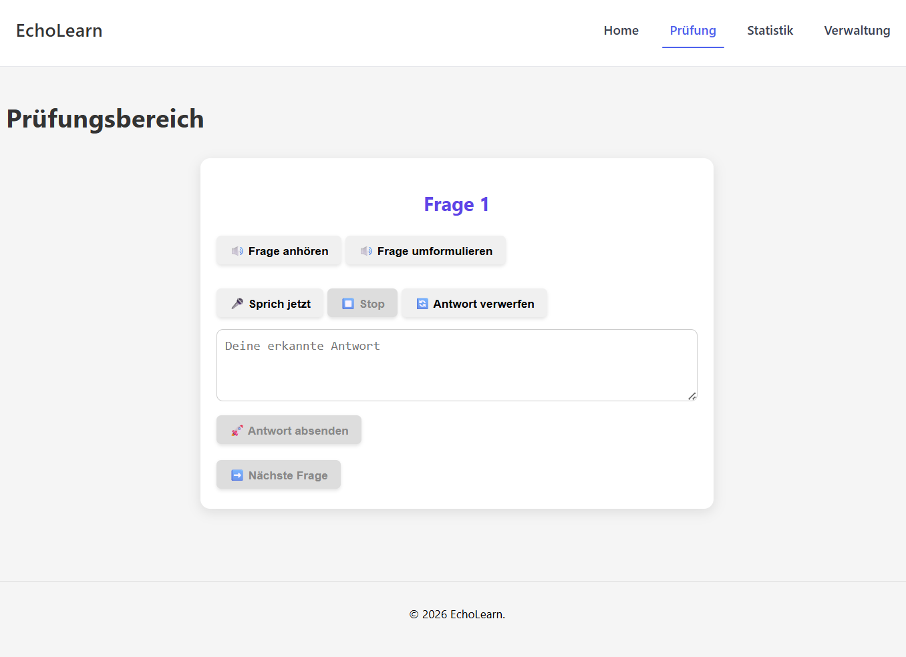

Nach Betätigung der Schaltfläche "Frage anhören" wird die jeweilige Frage abgespielt. 
Sollten die Frage nicht verstanden worden sein, kann diese nochmals angehört oder aber per Klick auf die Schaltfläche rechts daneben umformuliert werden.

Um zu Antworten wählt man anschließend "Sprich jetzt" und startet damit die Sprachaufzeichnung durch das STT-Modell.
Um diese nutzen zu können, wird zwingend ein Browser benötigt, welcher Speach-To-Text unterstützt, ansonsten wäre lediglich eine textuelle Eingabe der Antwort im Textfeld unterhalb möglich.

Die transkripierte Sprache wird im Textfeld unterhalb der Schaltfläche angezeigt. 

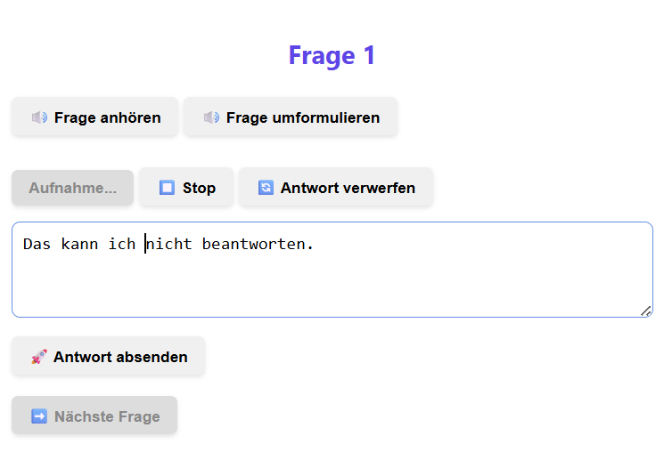

Die Sprachaufzeichnung läuft so lange bis die Schaltfläche "Stopp" oder aber direkt "Antwort absenden" ausgewählt wird. 

Vor dem Absenden der Antwort kann der erkannte Text im Textfeld bei Bedarf mit Tastatureingaben korrigiert werden.

Ist man mit der gesamten Spracherkennung nicht zufrieden oder hat eine falsche Antwort gegeben, kann diese über "Antwort verwerfen" gelöscht und im Anschluss im gleichen Prinzip neu aufgenommen werden.

Nach der Beantwortung einer Frage gibt folgende es 3 Optionen:
1. Die Frage wurde falsch oder lediglich in einer mangelhaften Qualität, also zu weniger als 50%, beantwortet: In diesem Fall wäre keine qualifizierte Ergänzungen zu erwarten und es wird direkt mit der nächsten Frage fortgefahren.

2. Die Frage wurde beantwortet, es sind aber noch deutliche Lücken erkennbar (Bewertung von 50 bis 80%): Hier erfolgt eine Rückfrage, sodass Lernende zum Beispiel fehlende Fach- oder Schlüsselbegriffe noch ergänzend erklären können, falls diese lediglich vergessen wurden. Die Rückfrage erscheint nach Absenden der teilweise korrekten Antwort unterhalb der ursprünglichen Frage.
Ein solcher Fall ist im nachfolgenden Screenshot dargestellt:

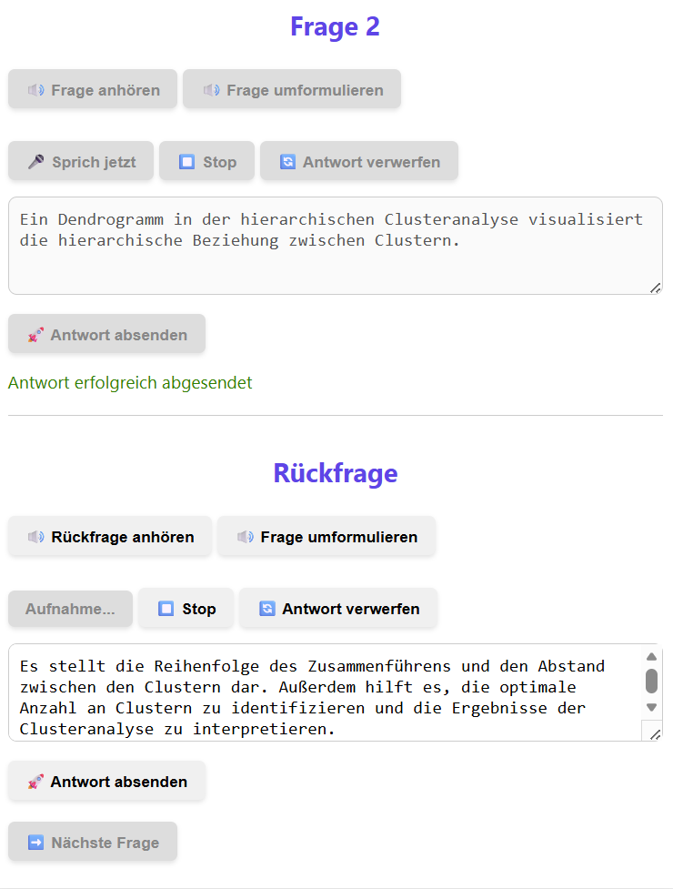


3. Die Frage wurde zu mindestens 80% korrekt beantwortet: Um den Trainingseffekt bei bereits guten oder sehr guten Kenntnissen zu verstärken, wird eine Vertiefungsfrage gestellt. 
Ähnlich wie im vorherigen Fall erscheint auch die Vertiefungsfrage unterhalb der Ausgangsfrage, wie im nachfolgenden Bild zu erkennen:

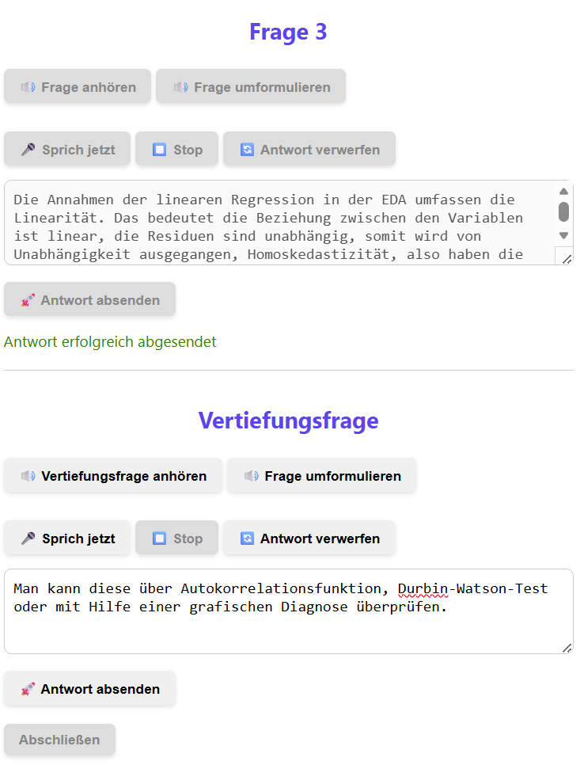


In den beiden letztgenannten Fällen erhalten Lernende erst nach Beantwortung der Vertiefungs- bzw. Rückfrage die nächste reguläre Frage. Bis dahin bleibt die Schaltfläche "Nächste Frage" / "Abschließen" ausgegraut und ohne Funktion.

Nach Beantwortung aller Fragen erscheint anstatt der Schaltfläche "Nächste Frage", der Button "Abschließen", welcher eine kurze Zusammenfassung der Prüfungssimulation aufruft:

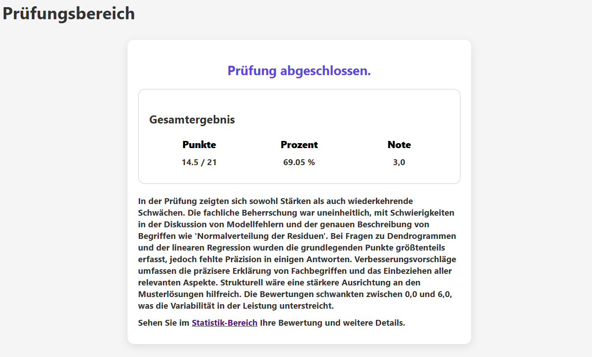

Wie auf dem oben abgebildeten Screenshot zu sehen, enthält diese das Gesamtergebnis ausgedrückt in den typischen Zahlen, die zur Bewertung einer Prüfung herangezogen werden, sowie eine kurze textuale Zusammenfassung der erkannten Stärken und Schwächen.

Im Prototyp wird die Note aus der Prozentzahl der erreichten Punkte gemäß Notenskala der [Prüfungsordnung der Fernuniversität Hagen](https://www.fernuni-hagen.de/wirtschaftswissenschaft/studium/download/ordnungen/po_bsc_wiwi.pdf) angegeben.

Details zu den einzelnen Fragen können im Anschluss im Statistik-Bereich eingesehen werden. 
Dieser ist im Text verlinkt, kann aber ebenso über den zu Beginn bereits erwähnten Menüpunkt "Statistik", welcher oben rechts zu finden ist, jederzeit erneut aufgerufen werden.

### Statistik

Die Statistik generiert sich während der Beantwortung der einzelnen Prüfungsfragen.

Im Kopf der Ergebnisübersicht wird erneut die Gesamtleistung mit Punkten, Prozentzahl und Note beziffert, darunter folgt eine Tabelle, welche für alle in der Prüfungssimulation beantworteten die im nachfolgenden Screenshot abgebildeten Daten enthält.

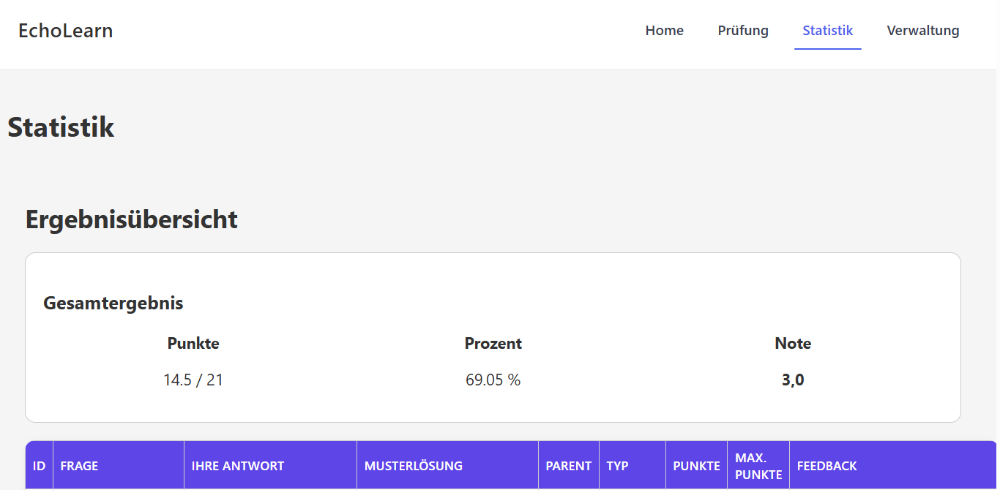

Dabei startet die ID bei 1 und ergibt sich aus der Reihenfolge der gestellten Fragen, indem fortlaufend gezählt wird. Parent gibt an, ob eine Verknüpfung zu einer anderen Frage existiert. Wenn dies der Fall ist, steht dort die ID der zugehörigen Frage, ansonsten "0". Die Spalte Typ unterscheidet zwischen "BASE", "CLARIFY" und "DEEPEN".
Bei "BASE" handelt es sich um die Basisfragen aus der Fragendatenbank, "CLARIFY" kennzeichnet die erhaltenen Rückfragen und "DEEPEN" steht für eine Vertiefungsfrage.

Für die Berechnung werden die Vertiefungsfragen wie eigenständige Fragen behandelt, die vollständig in die Bewertung eingehen. 

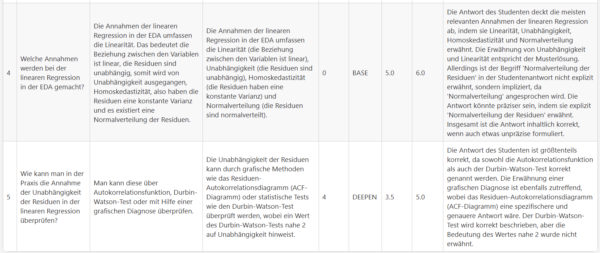

Antworten auf Rückfragen ergänzen dagegen die Basisfrage. Die erhaltenen Punkte bei "CLARIFY" beziehen sich auf die kombinierte Antwort aus der zugehörigen Basisfrage und der Rückfrage. Das bedeutet eine Rückfrage sorgt nicht für eine Erhöhung der gesamt zu erreichenden Punktzahl, sondern es geht in diesem Fall nur die erreichte sowie die maximal zu erreichende Punktzahl aus "CLARIFY" in die Gesamtbewertung ein, die Bewertung der zugehörigen "Basisfrage" wird ignoriert und daher leicht ausgegraut in der Statistik dargestellt:

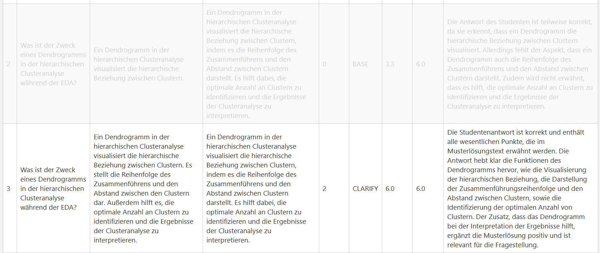

Besonderheit der Statistik:
Diese wird aktuell fortgeschrieben, wenn weitere Prüfungssimulationen absolviert werden. Es erfolgt eine Verrechnung der simulationsübergreifend erhaltenen Punkte.
Wird eine komplett neue Bewertung gewünscht, muss die Datenbank vor der Durchführung der nächsten Prüfungssimulation zurückgesetzt werden.

Wird die Statistik aufgerufen, ohne das vorab eine Frage beantwortet wurde, erscheint folgendes Bild:


### Verwaltung

Über den Menüpunkt "Verwaltung" können die zur Prüfungssimulation zu verwendenden Fragen eingesehen, bearbeitet, gelöscht oder ergänzt werden.

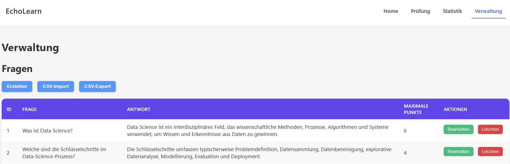

Um eine zusätzliche Frage zu ergänzen, klickt man unter "Questions" auf die Schaltfläche "Erstellen".
Es öffnet sich die nachfolgende Eingabemaske:

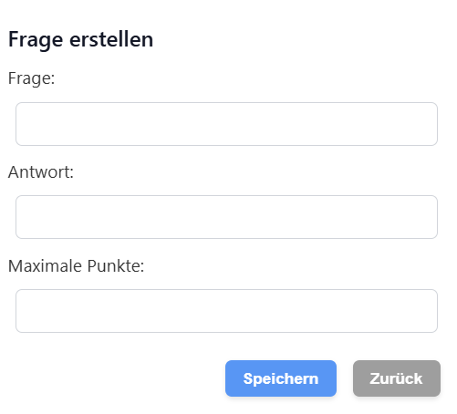

Alle 3 Felder müssen befüllt und anschließen gespeichert werden, damit die Frage korrekt im System übernommen und in einer Prüfungssimulation verwendet werden kann.

Jede Frage, die in der Datenbank vorhanden ist, kann über die in grün dargestellte Schaltfläche in der Spalte "Aktionen" bearbeitet werden:

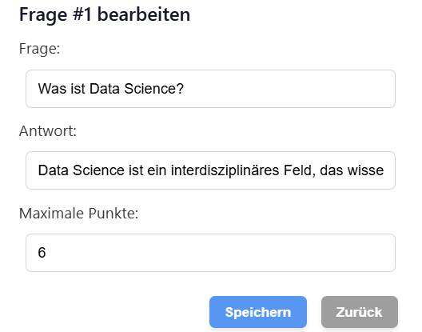

Vorgenommene Änderungen werden mit Betätigung der Schaltfläche "Save" übernommen.

### Beendigung der Prüfungssimulation

Um den Prototypen zu beenden, kann der Browser, in dem das Frontend geöffnet wurde, geschlossen, die VPN-Verbindung zum Server der Fernuniversität getrennt und der Prototyp mit dem Befehl "make down" beendet werden.

---

## Evaluation

Diese Dokumentation beschreibt das Evaluationsvorgehen im Rahmen des Projekts **Echolearn**. Ziel war es, sowohl die Qualität eines Speech-to-Text-(STT)-Modells als auch die Leistungsfähigkeit eines Large Language Models (LLM) als automatischen Prüfungsbewerter („LLM Judge“) systematisch zu untersuchen.

---

### Zielsetzung der Evaluation

Um die in der Einleitung aufgestellten Fragen beantworten zu können, wurde die Evaluation in vier Bereiche unterglieder:

1. `Evaluation der Datenanreicherung`
2. `Evalaution des STT-Modells` 
3. `Evaluation der LLMs`  
4. `Evaluation der LLMs mit dem Transkript des STT-Modells`  

In einem ersten Schritt wurde betrachtet, inwiefern das LLM die Übersetzung der Fragen und Antworten inklusive Klassifizierung und Vergabe von maximal zu erreichenden Punkten gemäß Vorgaben im Prompt zielführend durchführen kann. 
Im zweiten Bereich wurde die Qualität der automatischen Transkription von gesprochenen Prüfungsantworten evaluiert. Ziel war es, zu messen, wie stark die vom STT-Modell erzeugten Transkripte von den ursprünglich intendierten (korrekten) Antworten abweichen und ob dabei ein Unterschied bei verschiedenen Dialekten von Lernenden erkennbar wird. Die Auswertung dient dabei als Grundlage für die nachgelagerte Evaluation des LLM Judges, sowie zur Einschätzung der Transkriptionsqualität und zur möglichen Identifikation erkennbarer Schwachstellen. Letztlich soll somit die Frage geklärt werden, ob die Transkriptionsqualität ausreicht, um darauf eine automatisierte Bewertung aufzubauen.
Im dritten Schritt wurde untersucht, wie gut ein LLM als automatischer Prüfungsbewerter („Exam Judge“) operiert. Hierzu wurden schriftlich verfasste Antworten verwendet, um einerseits die Korrelation mit menschlichen Korrektoren unter optimalen Bedingungen, also mit perfekten Transkripten, zu analysieren und gleichzeitig einen Vergleich zu den transkripierten Antworten zu ermöglichen. Mit diesen Daten soll die Frage geklärt werden, ob ein LLM als automatischer Bewerter und Feedbackgeber zum Lernen geeignet ist.
In letzten Schritt wurde untersucht, wie robust der LLM Judge gegenüber Transkriptionsfehlern ist.  
Im Unterschied zur vorherigen Evaluation erhält das LLM hier **nicht die originalen studentischen Antworten**, sondern die vom STT-Modell erzeugten Transkripte.

Damit wird die realistische Pipeline simuliert:

> Gesprochene Antwort → STT → Transkript → LLM Judge → Bewertung

Auf diese Weise soll die Frage beantwortet werden, wie robust die Bewertung des LLM trotz Transkriptionsfehlern oder sprachlichen Unschärfen ist, sowie ob bestimmte Fehlertypen besonders starke Auswirkungen auf Bewertungsunterschiede haben.

---

### 1. Evaluationsaufbau der Analyse der Datenanreicherung

#### Datengrundlage

Die zur Analyse verwendeten Daten stammen aus der Datei: generated_q_and_a.csv

Diese enthält unter anderem:

- `question` – Prüfungsfrage auf Deutsch
- `answer` – Musterlösung auf Deutsch 
- `max_points` – maximal erreichbare Punkte  
- `keywords` - die wichtigen Schlüsselbegriffe der Antwort
- `classification` - die Klassifizierung des Fragetyps
- `original_question` - die Prüfungsfrage auf Englisch aus dem Ausgangsdatensatz
- `original_answer` - die Musterlösung auf Englisch aus dem Ausgangsdatensatz

#### Evaluationslogik

Die Analyse der Datenanreicherung mit Hilfe des LLMs erfolgte

---

### 2. Evaluationsaufbau der Analyse des STT-Modells

#### Datengrundlage

Die Rohdaten stammen aus der Datei: raw_data_all_evaluation_stt_model.csv


Diese enthält unter anderem:

- `question_de` – Prüfungsfrage auf Deutsch
- `answer_de` – Musterlösung auf Deutsch
- `student_answer` – vom Studierenden formulierte Antwort 
- `human_score` – von menschlichen Korrektoren vergebene Punkte  
- `max_points` – maximal erreichbare Punkte  
- `keywords` - die wichtigen Schlüsselbegriffe der Antwort
- `human_feedback` - das menschlich verfasste Feedback
- `error_type` - Der Fehlertyp beim Transkribieren

Für die STT-Evaluation werden insbesondere folgende Textpaare benötigt:

- Referenztext (originale studentische Antwort)
- STT-Transkript (automatisch erzeugt)

#### Evaluationslogik

Die Bewertung des Speech-to-Text-Modells erfolgte über textuelle Ähnlichkeitsmetriken zwischen Referenz und Transkript. Dabei wurde händisch der Fehlertyp annotiert, indem der Referenztext und der Transkript miteinander verglichen wurden. Es wurden vier Fehlertypen definiert, die in der Spalte `error_type` mit den Zahlen 0, 1, 2 und 3 annotiert wurden.
- Fehlertyp `0`: Beim Transkript werden keine Fehler beobachtet
- Fehlertyp `1`: Beim Transkript werden triviale Fehler beobachtet (z.B. dass statt das)
- Fehlertyp `2`: Beim Transkript werden moderate Fehler beobachtet (eine geringe Anzahl an Schlüsselbegriffen wird fehlerfhaft transkribiert)
- Fehlertyp `3`: Beim Transkript wird eine hohe Fehlerrate festgestellt (die meisten Schlüsselbegriffen sind fehlerhaft transkribiert worden)

#### Evaluationsprozess

1. Laden der Rohdaten aus der CSV-Datei  
2. Paarweiser Vergleich von Referenztext und STT-Transkript  
3. Annotation des Fehlertyps (0-3)
4. Aggregation der Ergebnisse über alle Antworten hinweg  

Es wurde sich dafür entschieden, Fehlertypen `0` und `1` in die Kategorie `akzeptabel` zu gruppieren. Dies bedeutet, dass mit diesen Fehlern eine automatisierte Bewertung weiterhin möglich ist.
Für Fehlertypen `2` und `3` wurde die Kategorie `nicht akzeptabel` gewählt.

---

### 3. Evaluationsaufbau der Analyse des evaluation_llm_exam_judge

#### Evaluationsdesign

Das LLM erhält:

- die Prüfungsfrage unter `question_de`
- die studentische Antwort unter `student_answer` 
- die maximale Punktzahl unter `max_points`
- die Musterlösung für die Prüfungsfrage unter `answer_de`

Um die für die spätere Analyse notwendigen Daten zu erhalten, wird das LLM zu folgendem Workflow angewiesen:
1. Er vergleich die studentische Antowrt `student_answer` mit der Musterlösung `answer_de`
2. Er bewertet in Textform die Antwort des Studenten basierend auf folgende Fragen: <br>
  &ensp;_1) Hat der Student den Sachverhalt fachlich korrekt dargestellt, ohne wesentliche Fehler oder falsche Zusammenhänge?_ <br>
  &ensp;_2) Verwendet der Student die relevanten Schlüsselbegriffe korrekt und im richtigen Kontext?_ <br>
  &ensp;_3) Geht der Student auf alle wesentlichen Aspekte der Fragestellung ein oder bleiben zentrale Punkte unbeantwortet?_ <br>
  &ensp;_4) Werden die angesprochenen Konzepte klar voneinander unterschieden und nicht miteinander vermischt?_ <br>
  &ensp;_5) Ist die Antwort logisch aufgebaut, nachvollziehbar formuliert und für den Prüfer gut verständlich?_ <br>
  &ensp;_6) Soll vom Prüfer eine Rückfrage gestellt werden, um auf Lücken zu prüfen?_
3. Basierend auf der studentischen Antwort, der Musterlösung und den maximal erreichbaren Punkten, vergibt das LLM eine Punktzahl, zwischen 0 und den maximal erreichbaren Punkten. Maximal können **6 Punkte** vergeben werden. Diese automatisch vergebenen Punkte werden anschließend mit den **menschlich vergebenen Punkten (`human_score`)** verglichen.
4. Das LLM entscheidet basierend auf der Vollständigkeit der studentischen Antwort, ob eine Rückfrage erforderlich ist. Dies wird mit den Zahlen 0 bis 3 angegeben, die folgendes bedeuten:<br>
  &ensp;_`0` bedeutet, dass keine Rückfrage notwendig ist._<br>
  &ensp;_`1` bedeutet, dass eine Rückfrage notwendig ist, die sich auf nicht genannte Fach- bzw. Schlüsselbegriffe bezieht._<br>
  &ensp;_`2` bedeutet, dass eine Rückfrage gestellt wird und sich auf eine fehlende Teilantwort bezieht._<br>
  &ensp;_`3` bedeutet, dass sich die gestellte Rückfrage auf einem Teil der falschen Antwort bezieht._<br>

#### Vergleichsmetriken

Zur Evaluation der Qualität des LLM Judges wurden folgende Kennzahlen berechnet:

- **Mean Absolute Error (MAE)** zwischen den vom Menschen vergebenen Punkte `human_score` und den vom LLM vergebenen Punkte `llm_rating`
- **Semantic Similarity** zwischen dem menschlichen Feedback `human_feedback` und dem Feedback vom LLM `llm_feebdack`.
Die Berechnung der semantischen Ähnlichkeit erfolgte wie folgt:
- Zunächst wurden die Embeddings von *human_feedback* und *llm_feedback* mit dem Modell `paraphrase-multilingual-MiniLM-L12-v2` von Sentence Transformers berechnet
- Es wurde die Kosinusähnlichkeit zwischen den resultierten Embeddings berechnet und in das DataFrame gespeichert

#### Evaluationsprozess

1. Iteration über alle Prüfungsantworten 
2. Übergabe der strukturierten Informationen an das LLM  
3. Extraktion des verfassten Feedbacks und der vergebenen Punktzahl aus der Modellantwort  
4. Vergleich mit dem menschlichen Feedback und Score  
5. Aggregierte statistische Auswertung  

---

### 4. Evaluationsaufbau der Analyse des evaluation_llm_exam_judge_transcript

#### Datengrundlage

Die Transkripte stammen aus der STT-Verarbeitung und sind mit den übrigen Metadaten (Frage, Musterlösung, max. Punkte, Human Score) verknüpft.

#### Evaluationsdesign

Um die für die spätere Analyse notwendigen Daten zu erhalten, wird das LLM zu folgendem Workflow angewiesen:
1. Er vergleich die transkribierte studentische Antowrt `transkript_stt_model` mit der Musterlösung `answer_de`
2. Er bewertet in Textform die Antwort des Studenten basierend auf folgende Fragen: <br>
  &ensp;_1) Hat der Student den Sachverhalt fachlich korrekt dargestellt, ohne wesentliche Fehler oder falsche Zusammenhänge?_ <br>
  &ensp;_2) Verwendet der Student die relevanten Schlüsselbegriffe korrekt und im richtigen Kontext?_ <br>
  &ensp;_3) Geht der Student auf alle wesentlichen Aspekte der Fragestellung ein oder bleiben zentrale Punkte unbeantwortet?_ <br>
  &ensp;_4) Werden die angesprochenen Konzepte klar voneinander unterschieden und nicht miteinander vermischt?_ <br>
  &ensp;_5) Ist die Antwort logisch aufgebaut, nachvollziehbar formuliert und für den Prüfer gut verständlich?_ <br>
  &ensp;_6) Soll vom Prüfer eine Rückfrage gestellt werden, um auf Lücken zu prüfen?_
3. Basierend auf der studentischen Antwort, der Musterlösung und den maximal erreichbaren Punkten, vergibt das LLM eine Punktzahl, zwischen 0 und den maximal erreichbaren Punkten. Maximal können **6 Punkte** vergeben werden. Diese automatisch vergebenen Punkte werden anschließend mit den **menschlich vergebenen Punkten (`human_score`)** verglichen.
4. Das LLM entscheidet basierend auf der Vollständigkeit der studentischen Antwort, ob eine Rückfrage erforderlich ist. Dies wird mit den Zahlen 0 bis 3 angegeben, die folgendes bedeuten:<br>
  &ensp;_`0` bedeutet, dass keine Rückfrage notwendig ist._<br>
  &ensp;_`1` bedeutet, dass eine Rückfrage notwendig ist, die sich auf nicht genannte Fach- bzw. Schlüsselbegriffe bezieht._<br>
  &ensp;_`2` bedeutet, dass eine Rückfrage gestellt wird und sich auf eine fehlende Teilantwort bezieht._<br>
  &ensp;_`3` bedeutet, dass sich die gestellte Rückfrage auf einem Teil der falschen Antwort bezieht._<br>

#### Vergleichsmetriken

Zur Evaluation der Qualität des LLM Judges wurden folgende Kennzahlen berechnet:

- **Mean Absolute Error (MAE)** zwischen den vom Menschen vergebenen Punkte `human_score` und den vom LLM vergebenen Punkte `llm_rating`
- **Semantic Similarity** zwischen dem menschlichen Feedback `human_feedback` und dem Feedback vom LLM `llm_feebdack`.
Die Berechnung der semantischen Ähnlichkeit erfolgte wie folgt:
- Zunächst wurden die Embeddings von *human_feedback* und *llm_feedback* mit dem Modell `paraphrase-multilingual-MiniLM-L12-v2` von Sentence Transformers berechnet
- Es wurde die Kosinusähnlichkeit zwischen den resultierten Embeddings berechnet und in das DataFrame gespeichert

#### Evaluationsprozess

1. Iteration über alle Prüfungsantworten 
2. Übergabe der strukturierten Informationen an das LLM  
3. Extraktion des verfassten Feedbacks und der vergebenen Punktzahl aus der Modellantwort  
4. Vergleich mit dem menschlichen Feedback und Score  
5. Aggregierte statistische Auswertung 

---

### Gesamtergebnis der Evaluation

Die vierstufige Evaluation im Projekt **Echolearn** erlaubt eine ganzheitliche Betrachtung der automatisierten Bewertung mündlicher Prüfungsleistungen. Dabei wurden sowohl die Qualität der Transkription (STT) als auch die Leistungsfähigkeit verschiedener LLMs als automatischer Prüfungsbewerter unter Ideal- und Realbedingungen untersucht.

#### 1. Bewertung der Datenanreicherung mittels LLM

Zur Analyse der Datenanreicherung mit Hilfe von Systemprompting durch Aufruf des LLM "phi4-latest" wurden sowohl die Übersetzungsqualität, die Bewertung der maximal erreichbaren Punkte für eine Beantwortung einer Frage als auch die Generierung von Schlüsselbegriffen betrachtet.

Die Analyse der semantische Ähnlichkeit der ins Deutsche übersetzten Antworten und Fragen weißen im Vergleich zum englischen Originaldatensatz eine hohe semantische Ähnlichkeite auf. 
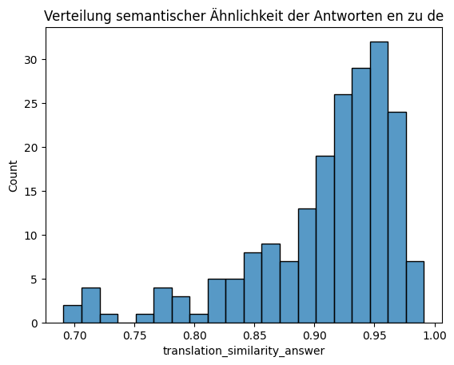

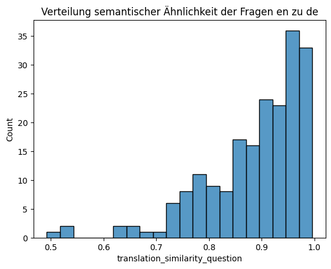

Auch die Analyse der Textlängen zeigt ebenfalls nur wenige Ausreißer:
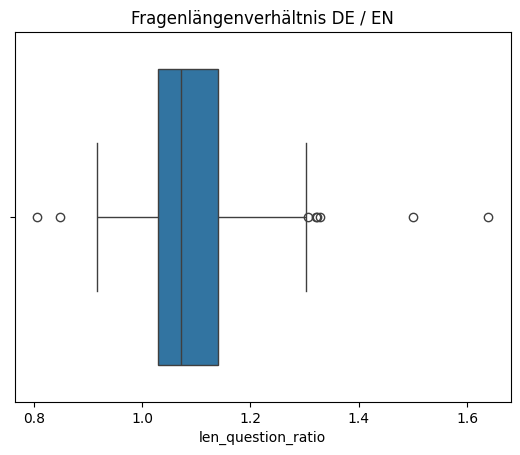

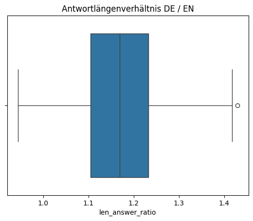

Auch im Systemtest selbst konnten manuell trotz der hohen Konzentration an Fachbegriffen und Abkürzungen kaum Abweichungen oder Unklarheiten erkannt werden.

Im Vergleich zur Qualität der Übersetzung ließ sich die Extraktion der Schlüsselbegriffe mit Hilfe von exaktem Vergleich zur Antwort nur bedingt analysieren, da bereits geringe Abwandlungen wie zum Beispiel die Verwendung von Einzahl oder Mehrzahl  einen exakten Abgleich erschwerte. Hier wurden daher Stichprobenhaft manuelle Kontrolle durchgeführt, welche grundsätzlich eine gute Übereinstimmung erkennen ließ.


Die nachfolgende Grafik zeigt auf der y-Achse die Verteilung der maximal erreichbaren Punkte sowie auf der x-Achse die Länge der Antwort mit frablicher Aufschlüsselung der Klassifizierung des Fragetyps: 
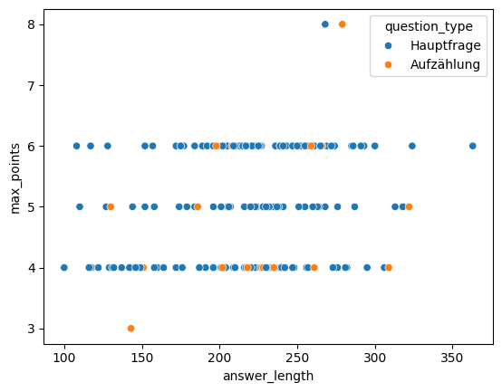

Aus dieser Grafik lässt sich ablesen, dass die erreichbaren Punkte sich im Rahmen der Vorgaben gemäß des Systemprompts bewegen. Auffällig ist, dass sich die Punktvergabe hauptsächlich im Bereich von 4 bis 6 Punkten bewegt und sich lediglich wenige Ausreißer im Bereich von 3 und 8 Punkten bewegen. Dieses Ergebnis war, bedingt durch den genutzten Datensatz, welcher fragenübergreifend eine hohe Ähnlichkeit der Antwortkomplexität aufweist, erwartbar.

---

#### 2. Bewertung des STT-Modells

- 64,2 % der Transkripte wurden als **akzeptabel** (Fehlertyp 0 oder 1) eingestuft.
- 35,8 % wurden als **nicht akzeptabel** (Fehlertyp 2 oder 3) klassifiziert.
- Hauptlimitation: fehlende Satzzeichen und teilweise fehlerhafte Transkription von Schlüsselbegriffen.

Trotz dieser Limitation wurde das STT-Modell als ausreichend leistungsfähig eingestuft, um in einer automatisierten Bewertungspipeline eingesetzt zu werden. Die Fehlerquote ist relevant, aber nicht so hoch, dass eine Weiterverarbeitung durch ein LLM grundsätzlich unmöglich wäre.

---

#### 3. Evaluation der LLMs mit Originalantworten


Unter Idealbedingungen (direkt vom Menschen verfasste Antworten) zeigte sich:

- Hohe semantische Ähnlichkeit zwischen menschlichem und LLM-Feedback bei den Top-Modellen.
- Geringe mittlere absolute Abweichung (MAE) zwischen `human_score` und `llm_rating`.
- Konsistente Rangfolge der leistungsstärksten Modelle.


Wie auf der Grafik zu sehen, werden hier zwei Metriken nebeneinander präsentiert:
- `sem_sim_mean`: Das ist die durschnittliche semantische Ähnlichkeit zwischen *human_feebdack* und *llm_feedback* pro LLM
- `ok_10_rate`: Die Anzahl der Abweichungen zwischem *human_score* und *llm_rating* um 1.0-Punkten

**Top-3 Modelle (Originalantworten):**

1. `phi4:latest`  
2. `gemma3:27b`  
3. `llama3.3:latest`  

`phi4:latest` überzeugte insbesondere durch:
- Gute Übereinstimmung mit menschlichen Punktvergaben  
- Hohe semantische Nähe im Feedback  
- Stabilität über verschiedene Antworttypen hinweg  

---

#### 4. Evaluation der LLMs mit STT-Transkripten

Unter realistischen Pipeline-Bedingungen (STT → LLM) zeigte sich:

- Ein Rückgang der semantischen Ähnlichkeit (`sem_sim_mean`)
- Eine leichte Verschlechterung der Punktgenauigkeit
- Größere Sensitivität gegenüber Transkriptionsfehlern

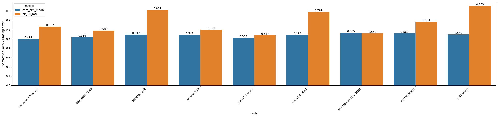
Wie auf der Grafik zu sehen, werden hier zwei Metriken nebeneinander präsentiert:
- `sem_sim_mean`: Das ist die durschnittliche semantische Ähnlichkeit zwischen *human_feebdack* und *llm_feedback* ro LLM
- `ok_10_rate`: Die Anzahl der Abweichungen zwischem *human_score* und *llm_rating* um 1.0-Punkten

Im Vergleich zur vorherigen Evaluation sind die Ergebnisse der `sem_sim_mean` hier schlechter, aufgrund der zu Beginn genannten Limitation des STT-Modells. 

**Top-3 Modelle (Transkripte):**

1. `mistral-small3.1:latest`  
2. `mixtral:latest`  
3. `phi4:latest`  

Obwohl sich das Ranking verschob, blieb `phi4:latest` weiterhin unter den leistungsstärksten Modellen und zeigte insgesamt eine robuste Performance – auch bei verrauschten Eingaben.

---

### Gesamtbewertung der Pipeline

Die kombinierte Betrachtung aller vier Evaluationsschritte zeigt:

- Das STT-Modell liefert in der Mehrheit der Fälle verwertbare Transkripte.
- LLMs sind grundsätzlich in der Lage, Prüfungsleistungen automatisiert zu bewerten.
- Transkriptionsfehler wirken sich messbar auf die Bewertungsqualität aus, dennoch bleibt die Gesamtperformance auf einem praktikablen Niveau.

---

### Modell-Entscheidung

Auf Basis der Evaluationsergebnisse wurde das Modell **`phi4:latest`** für die Anwendung in Echolearn ausgewählt.

Die positiven Aspekte in Bezug auf die Performance sowie die praktische Eignung wurden nachfolgen stichpunktartig nochmals hervorgehoben:

1. **Beste Gesamtperformance unter Idealbedingungen**  
   - Höchste semantische Ähnlichkeit zum menschlichen Feedback  
   - Sehr geringe Abweichung in der Punktvergabe  

2. **Robuste Performance unter Realbedingungen**  
   - Auch mit STT-Transkripten weiterhin unter den Top-Modellen  
   - Keine drastische Performance-Degradation  

3. **Praktische Eignung für Echolearn**  
   - Verlässliche Punktvergabe  
   - Nachvollziehbares, strukturiertes Feedback  
   - Gute Skalierbarkeit für den produktiven Einsatz  

---

## Limitationen
- Bewertung basiert auf probabilistischen Sprachmodellen
- keine pädagogische Validierung der Bewertungsqualität
- keine Benutzerstudie zur Wirksamkeit
- Speech-to-Text abhängig von Audioqualität und gewähltem Modell
- eingeschränkter Testdatensatz
- Laufzeitperformance
- Umgang und konsequente Erkennung von Abkürzungen
- Anpassung an System-Prompts

Das im Projekt verwendete STT-Modell hat beim Transkribieren teilweise keine Satzzeichen gesetzt. Bei einer Antowrt, die aus mehreren Sätzen besteht, kann dies die Bewertungsergebnisse beeinflussen.

---

## Einordnung
- empirische Evaluation mit Studierenden
- adaptive Schwierigkeitsmodelle
- personalisierte Lernpfade
- Benutzerkonten und Langzeittracking
- Lernmodus (Active Recall und Spaced Repetition) implementieren

---

## Fazit

Die Evaluation des Prototyps zeigt, dass eine automatisierte Bewertung mündlicher gegebener Antworten technisch möglich und somit eine Unterstützung beim Lernen und Üben für mündliche Prüfungen realisierbar ist.

Als zentrale Erkenntnisse können dabei folgende Punkte herausgestellt werden:

- Die Qualität der Transkription ist ein entscheidender Faktor für die Gesamtperformance.
- LLMs können menschliche Bewertungen bereits in vielen Fällen mit hoher Übereinstimmung approximieren.
- Eine sorgfältige Modellwahl ist essenziell, da sich Modelle unterschiedlich sensitiv gegenüber Transkriptionsfehlern und der Verwendung von Fachbegriffen und Abkürzungen zeigen.
- Die Laufzeit während der Prüfungssimulation ist ein kritischer Faktor, um einen praxistauglichen Lernfluss zu gewährleisten.

Mit der Entscheidung für **`phi4:latest`** wurde aus den zur Verfügung stehenden LLM-Modellen der Fernuniversität Hagen ein Modell gewählt, welches sowohl unter Ideal- als auch unter Realbedingungen eine stabile und leistungsfähige Bewertung ermöglicht.

Der Prototyp "EchoLearn" demonstriert damit die Leistungsfähigkeit von LLM-Modellen zur automatisierten Bewertung. Eine Unterstützung bei der Vorbereitung auf mündliche Prüfungsvorbereitung ist aus Sicht der Projektbeteiligten gegeben, allerdings mit klar identifizierten Verbesserungspotenzialen im Bereich der Laufzeit, der Transkription und adaptiven Anpassung auf Prüfungsthemen sowie Bewertungsschwerpunkte.

---

## Verantwortungsbereiche

**Sandra Fischer**

- Daten (Generation, Cleaning, Evaluationsdatensätze)
- Evaluation (menschliche Bewertung von Evaluationsdatensätzen, Notebooks zur LLM Evaluation)
- Testen
- Dokumentation (Gesamtaufbereitung, Datenstruktur, Evaluation, Limitation, Einordnung, Fazit)

**Aleksandar Trifonov**

- Backend (funktionale und inhaltliche Anbindung der LLMs in die App, Bereitstellung der Daten für die LLMs, Testen der Funktionalitäten)
- Evaluation (menschliche Bewertung von Evaluationsdatensätzen, Notebooks zur LLM Evaluation)
- Dokumentation (Backend, Evaluation)

**Maurice Haas**

- Projektarchitektur (Docker, CI Pipelines, Linter, Formatter, Make-Befehle)
- Frontend (STT, TTS, Design, Vue Komponenten & Templates, Frontend Routen)
- Backend (CRUD Routen, CSV-Export/Import Routen), Datenbankverbindung, Skript für automatische Datenbankerstellung und Löschung
- Evaluation (menschliche Bewertung von Evaluationsdatensätzen)
- Dokumentation (Readme, Frontend, Architektur)

---

