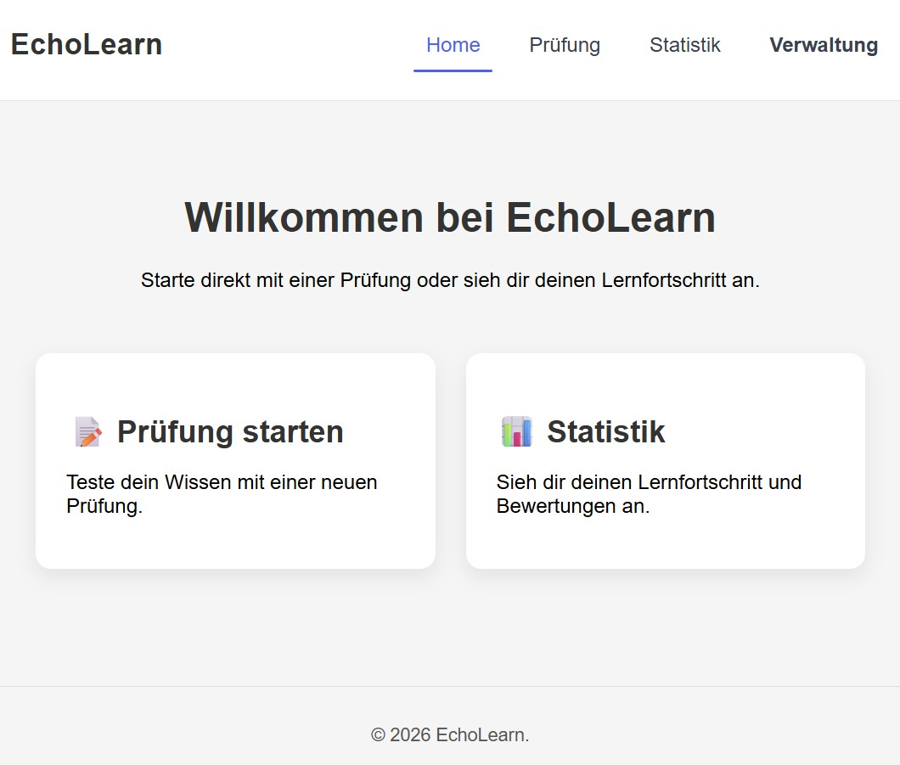
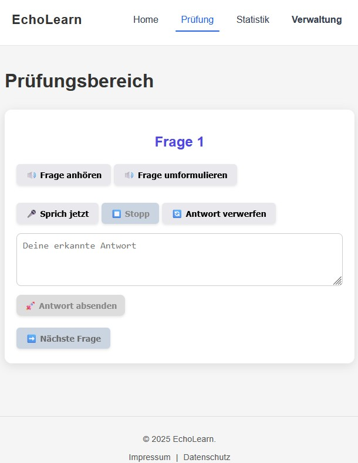

# Projektdokumentation

---

## Inhaltsverzeichnis

- [Einleitung](#einleitung)
  - [Motivation & Ziel des Projekts](#motivation--ziel-des-projekts)
  - [Projektansatz](#projektansatz)
- [Systemarchitektur](#systemarchitektur)
  - [Überblick Gesamtarchitektur](#überblick-gesamtarchitektur)
  - [Dokumentation des Backends](#dokumentation-des-backends)
    - [Überblick Backend](#backend-überblick)
    - [Aktuelle Ordnerstruktur](#aktuelle-ordnerstruktur)
    - [Aktive Router in 'main.py'](#aktive-router-in-mainpy)
    - [Datenbank](#datenbank)
    - [Modelle](#modelle)
    - [LLM-Integration](#llm-integration)
    - [API-Referenz](#api-referenz)
    - [Fachlogik](#fachlogik)
  - [Dokumentation des Frontends](#dokumentation-des-frontends)
    - [Aktuelle Ordnerstruktur](#aktuelle-ordnerstruktur-1)
    - [Views und Components](#views-und-components)
     - [Views](#views)
     - [Components](#components)
    - [Composables](#composables)
      - [1. 'useSpeechRecognition'](#1-usespeechrecognition)
      - [2. 'speakText'](#2-speaktext)
      - [Vorteile der Composables](#vorteile-der-composables)
    - [Routing](#routing)
  - [Dokumentation der Datengeneration und -aufbereitung](#dokumentation-der-datenaufbereitung)
  - [Schnittstellen](#schnittstellen)
  - [verwendete Technologien](#verwendete-technologien)
- [Installation und Setup](#installation-und-setup)
- [Nutzerleitfaden und Demo](#nutzerleitfaden--demo)
- [Evaluation](#evaluation)
  - [Zielsetzung](#zielsetzung-1)
  - [Evaluation des Speach-to-text-Modells](#1-evaluation-des-stt-modells)
    - [Datengrundlage](#datengrundlage)
    - [Evaluationslogik](#evaluationslogik)
    - [Evaluationsprozess](#evaluationsprozess)
  - [Evaluation der Large Language Modells als Prüfungsbewerter](#2-evaluation_llm_exam_judge)
    - [Evaluationsdesign](#evaluationsdesign)
    - [Vergleichsmetriken](#vergleichsmetriken)
    - [Evaluationsprozess](#evaluationsprozess-1)
  - [Evaluation der Large Language Modells auf Robustheit](#3-evaluation_llm_exam_judge_transcript)
    - [Datengrundlage](#datengrundlage-1)
    - [Evaluationsdesign](#evaluationsdesign-1)
    - [Vergleichsmetriken](#vergleichsmetriken-1)
    - [Evaluationsprozess](#evaluationsprozess-2)
  - [Ergebnis der Evaluation](#gesamtergebnis-der-evaluation)
- [Limitationen](#limitationen)
- [Einordnung](#einordnung)
- [Ausblick](#ausblick)
- [Fazit](#fazit)
- [Verantwortlichkeiten im Projekt](#verantwortungsbereiche)
- [Quellen](#quellen)


## Einleitung
EchoLearn ist ein interaktiver Prototyp zur Simulation mündlicher Prüfungssituationen zum Thema Data Science.  
Das System stellt Fragen, verarbeitet gesprochene Antworten, bewertet diese automatisiert und generiert je nach Qualität der Antwort adaptive Rück- oder Vertiefungsfragen, um einen prüfungsähnlichen Dialog zu erzeugen.

Das Projekt wurde im universitären Kontext als experimenteller Prototyp entwickelt und dient der konzeptionellen Untersuchung KI-gestützter Bewertung frei gegebener mündlicher Antworten.

---

### Motivation & Ziel des Projekts
Die Vorbereitung auf mündliche Prüfungen ist oft eingeschränkt, da sie typischerweise eine zweite Person erfordert und reale Prüfungssituationen nur schwer reproduzierbar sind.

Digitale Lernsysteme bieten häufig nur:

- Multiple-Choice-Tests
- statische Übungsfragen
- nicht-interaktive Lernmaterialien

Das Ziel des Projekts besteht daher darin zu untersuchen, inwiefern durch Speach-To-Text (STT) mündlich gegebene Antworten von Lernenden korrekt transkripiert und im Anschluss mit Hilfe von Large Language Modells (LLMs) mit einer vordefinierten Antwort aus einem Datensatz abgeglichen und sowohl eine textuelle als auch eine quantitative Bewertung generiert werden kann, welche den Lernenden dabei hilft, sich besser auf mündliche Prüfungen und Klausuren vorzubereiten.

Hierfür wurden im Projekt folgende Leitfragen untersucht:
1. Kann ein LLM die Generierung einer Klassifizierung von Fragetypen sowie maximal zu erreichenden Punkten inklusive Übersetzung von Antworten und Fragen aus dem Englischen ins Deutsche zuverlässig übernehmen?
2. Ist die Transkripitonsqualität des STT ausreichend, um darauf aufbauend automatisierte Bewertungen durch ein LLM erzeugen zu lassen?
3. Ist ein LLM als automatischer Bewerter und Feedbackgeber zum Lernen geeignet? 
4. Wie robust ist die Bewertung des LLM trotz Transkriptionsfehlern oder sprachlichen Unschärfen?

---

### Projektansatz
Um das Ziel des Projekts zu erreichen, wurde mit "EchoLearn" ein Prüfungssimulator entwickelt, der den Ansatz verfolgt, einen adaptiven Prüfungsdialog zu simulieren, auf offene Antworten zu reagiert und gezielte Rückfragen zu stellen, um anschließend durch spezifisches Feedback eine kontinuierliche Verbesserung des Wissensstandes von Lernenden zu ermöglichen.
Im Prototyp enthält die Prüfung zum Testen lediglich 3 Fragen. Zum Einsatz zur Prüfungsvorbereitung empfehlen wir 7 bis 10 Fragen, um einen Übungseffekt zu erzielen und sich der Dauer einer realen mündlichen Prüfung anzunäher.
Es wurden Prüfungen simuliert, eine automatische textuale sowie quantitative Bewertung durch verschiedene LLMs erzeugt und diese mit einer Referenzbewertung, welche durch die Projektmitglieder vergeben wurde, verglichen, um eine Evaluation durchführen zu und so die zentralen Fragestellungen des Projekts beantworten zu können.
"EchoLearn" fokusiert sich auf Grund des begrenzten zeitlichen Projektrahmens auf die Erstellung eines Prototypen, um eine grobe Einschätzung einer möglichen Umsetzung der Projektidee zu erhalten. Es wurde daher bewusst auf eine Integration innerhalb eines Lernmanagementsystems verzichtet und lediglich mit einem begrenzten Evaluationsdatensatz gearbeitet. Auf Grund des zeitlichen Rahmens wurde auf eine Analyse der Qualität der generierten Ergänzungsfragen sowie Vertiefungsfragen bewusst verzichtet und lediglich die grundsätzliche Möglichkeit zur Integration im Prototyp demonstriert.
---

## Systemarchitektur

---

### Überblick Gesamtarchitektur

---

### Dokumentation des Backends

---

#### Backend-Überblick

Das EchoLearn-Backend ist der Teil des Systems, der den Prüfungsablauf im Hintergrund steuert.  
Es verwaltet Fragen, nimmt Antworten entgegen, lässt diese vom LLM bewerten und speichert sowohl Einzelbewertungen als auch das Gesamtfeedback einer Sitzung.

Grob ist der Code in drei Bereiche aufgeteilt:
- `routers/`: Hier kommen HTTP-Anfragen an und werden an die passende Logik weitergegeben.
- `services/`: Hier liegt die eigentliche Fachlogik (z. B. Bewertung und nächste Aktion).
- `models/` + `core/db.py`: Hier ist definiert, wie Daten gespeichert werden.

#### Aktuelle Ordnerstruktur

- `backend/app/main.py`: Startpunkt der FastAPI-Anwendung, inklusive CORS und Router-Einbindung
- `backend/app/core/`: Basis-Setup wie die Datenbankverbindung (`db.py`)
- `backend/app/models/`: SQLAlchemy-Modelle für die Tabellen
- `backend/app/routers/`: API-Endpunkte
- `backend/app/services/`: LLM-Integration und Prüfungslogik
- `backend/app/seed/`: Seed-Skript zum Neuaufsetzen der Tabellen und Befüllen mit Startdaten
- `backend/app/utils/`: vorhanden, derzeit ohne aktive Nutzung

#### Aktive Router in `main.py`

Aktuell sind folgende Router aktiv eingebunden:
- `questions.router`
- `exam.router`
- `exam_evaluation_single_answers.router`

#### Datenbank

- Verbindungs-URL in `backend/app/core/db.py`:
  - `postgresql+asyncpg://echolearn:echolearn@db:5432/echolearn`

- `backend/app/seed/seed_data.py`:
  - setzt die Tabellen neu auf (`drop_all` + `create_all`)
  - lädt Fragen aus `data/processed/questions.csv` in die Datenbank

#### Modelle

- `Question` (`questions`)
  - `id` (`Integer`, PK)
  - `question` (`Text`, Pflicht)
  - `answer` (`Text`, Pflicht)
  - `max_points` (`Text`, Pflicht)

- `ExamEvaluationSingleAnswer` (`exam_evaluation_single_answer`)
  - `id` (`Integer`, PK)
  - `parent_id` (`Integer`)
  - `unique_exam_id` (`Text`, Pflicht)
  - `question_type` (`Text`, Pflicht)
  - `question` (`Text`, Pflicht)
  - `student_answer` (`Text`, Pflicht)
  - `correct_answer` (`Text`, Pflicht)
  - `feedback` (`Text`, Pflicht)
  - `rating` (`Text`, Pflicht)
  - `max_points` (`Text`, Pflicht)

- `ExamEvaluationFinal` (`exam_evaluation_final`)
  - `id` (`Integer`, PK)
  - `unique_exam_id` (`Text`, Pflicht)
  - `overall_feedback` (`Text`, Pflicht)

#### LLM-Integration

Die Kommunikation mit dem Modellserver ist zentral in `backend/app/services/llm_handler.py` gekapselt.  
So bleibt die Fachlogik unabhängig von den technischen Details des LLM-Aufrufs.

- Modellserver:
  - `http://catalpa-llm.fernuni-hagen.de:11434/api/generate`

- Standardmodell:
  - `phi4:latest`

- Prompt-Quellen:
  - `backend/app/services/prompts.py`

- Fachliche Orchestrierung:
  - `backend/app/services/exam_simulator.py`

#### API-Referenz

##### Questions (`/questions`)

- <span style="background:#1d4ed8;color:#ffffff;padding:2px 6px;border-radius:4px;font-weight:700;">GET</span> ` /questions/`
  - gibt alle gespeicherten Fragen zurück
  - Eingabeparameter: keine
  - Request-Body: keiner
  - Response (JSON):
    ```json
    [
      {
        "id": 1,
        "question": "Was ist ...?",
        "answer": "Die Antwort ist ...",
        "max_points": "5"
      }
    ]
    ```

- <span style="background:#1d4ed8;color:#ffffff;padding:2px 6px;border-radius:4px;font-weight:700;">GET</span> ` /questions/random`
  - liefert bis zu 7 zufällige Fragen für eine Session
  - Eingabeparameter: keine
  - Request-Body: keiner
  - Response (JSON):
    ```json
    [
      {
        "id": 3,
        "question": "Erkläre ...",
        "answer": "Dabei gilt ...",
        "max_points": "5"
      }
    ]
    ```

- <span style="background:#1d4ed8;color:#ffffff;padding:2px 6px;border-radius:4px;font-weight:700;">GET</span> ` /questions/{question_id}`
  - liefert eine einzelne Frage anhand der ID
  - Eingabeparameter (Path): `question_id: int`
  - Request-Body: keiner
  - Response (JSON):
    ```json
    {
      "id": 1,
      "question": "Was ist ...?",
      "answer": "Die Antwort ist ...",
      "max_points": "5"
    }
    ```
  - `404`, wenn nicht vorhanden

- <span style="background:#16a34a;color:#ffffff;padding:2px 6px;border-radius:4px;font-weight:700;">POST</span> ` /questions/`
  - legt eine neue Frage an
  - Eingabeparameter: keine
  - Body:
    ```json
    {
      "question": "Frage",
      "answer": "Antwort",
      "max_points": "5"
    }
    ```
  - Response (JSON):
    ```json
    {
      "id": 42,
      "question": "Frage",
      "answer": "Antwort",
      "max_points": "5"
    }
    ```

- <span style="background:#d97706;color:#ffffff;padding:2px 6px;border-radius:4px;font-weight:700;">PATCH</span> ` /questions/{question_id}`
  - aktualisiert einzelne Felder einer Frage (`question`, `answer`, `max_points`)
  - Eingabeparameter (Path): `question_id: int`
  - Body (alle Felder optional):
    ```json
    {
      "question": "Neue Frage",
      "answer": "Neue Antwort",
      "max_points": "6"
    }
    ```
  - Response (JSON):
    ```json
    {
      "id": 42,
      "question": "Neue Frage",
      "answer": "Neue Antwort",
      "max_points": "6"
    }
    ```
  - `404`, wenn nicht vorhanden

- <span style="background:#dc2626;color:#ffffff;padding:2px 6px;border-radius:4px;font-weight:700;">DELETE</span> ` /questions/{question_id}`
  - löscht eine Frage
  - Eingabeparameter (Path): `question_id: int`
  - Request-Body: keiner
  - Response (JSON):
    ```json
    {
      "message": "Question deleted successfully"
    }
    ```
  - `404`, wenn nicht vorhanden

- <span style="background:#16a34a;color:#ffffff;padding:2px 6px;border-radius:4px;font-weight:700;">POST</span> ` /questions/import`
  - importiert Fragen aus einer CSV-Datei (Multipart, Feld `file`)
  - Eingabeparameter: keine
  - erwartet Spalten: `question`, `answer`, `max_points`
  - Antwort: `{"imported": <anzahl>}`
  - Response (JSON):
    ```json
    {
      "imported": 25
    }
    ```
  - `400` bei fehlender Datei/falschem Dateityp

- <span style="background:#1d4ed8;color:#ffffff;padding:2px 6px;border-radius:4px;font-weight:700;">GET</span> ` /questions/export`
  - exportiert alle Fragen als CSV (`questions.csv`)
  - Eingabeparameter: keine
  - Request-Body: keiner
  - Response:
    - kein JSON
    - `text/csv; charset=utf-8`
    - Header: `Content-Disposition: attachment; filename=questions.csv`

##### Exam (`/exam`)

- <span style="background:#16a34a;color:#ffffff;padding:2px 6px;border-radius:4px;font-weight:700;">POST</span> ` /exam/rephrase_question`
  - formuliert eine Frage verständlicher um (inhaltlich gleich)
  - Eingabeparameter: keine
  - Body:
    ```json
    { "question": "Originalfrage" }
    ```
  - Response (JSON):
    ```json
    {
      "answer_llm": "Vereinfachte Version der Frage"
    }
    ```

- <span style="background:#16a34a;color:#ffffff;padding:2px 6px;border-radius:4px;font-weight:700;">POST</span> ` /exam/evaluate_answer`
  - bewertet eine einzelne Antwort
  - kann abhängig vom Ergebnis eine Folgeaktion/Folgefrage auslösen
  - Eingabeparameter: keine
  - Body:
    ```json
    {
      "unique_exam_id": "exam-123",
      "question": "Fragetext",
      "student_answer": "Antwort",
      "correct_answer": "Musterlösung",
      "max_points": 5,
      "evaluate_only": false,
      "parent_id": 0,
      "question_type": "BASE"
    }
    ```
  - Response (JSON):
    ```json
    {
      "feedback": "Fachlich solide, ein Aspekt fehlt noch.",
      "rating": 3.5,
      "next_action": "CLARIFY",
      "followup_text": "Gehe noch auf ... ein.",
      "answer_id": 12,
      "next_max_points": 0,
      "next_answer": ""
    }
    ```

- <span style="background:#16a34a;color:#ffffff;padding:2px 6px;border-radius:4px;font-weight:700;">POST</span> ` /exam/evaluate_exam`
  - erstellt das Gesamtfeedback für eine komplette Prüfung
  - Eingabeparameter: keine
  - Body:
    ```json
    { "unique_exam_id": "exam-123" }
    ```
  - Response (JSON):
    ```json
    {
      "final_feedback": "Insgesamt zeigst du ein gutes Verständnis ..."
    }
    ```

### Exam-Einzelbewertungen (`/exam_evaluation_single_answers`)

- <span style="background:#1d4ed8;color:#ffffff;padding:2px 6px;border-radius:4px;font-weight:700;">GET</span> ` /exam_evaluation_single_answers/`
  - liefert alle gespeicherten Einzelbewertungen
  - Eingabeparameter: keine
  - Request-Body: keiner
  - Response (JSON):
    ```json
    [
      {
        "id": 12,
        "parent_id": 0,
        "unique_exam_id": "exam-123",
        "question_type": "BASE",
        "question": "Fragetext",
        "student_answer": "Antwort",
        "correct_answer": "Musterlösung",
        "feedback": "Feedback",
        "rating": "3.5",
        "max_points": "5.0"
      }
    ]
    ```

- <span style="background:#1d4ed8;color:#ffffff;padding:2px 6px;border-radius:4px;font-weight:700;">GET</span> ` /exam_evaluation_single_answers/exam/{exam_id}`
  - liefert die Einzelbewertungen zu einer bestimmten `exam_id`
  - Eingabeparameter (Path): `exam_id: str`
  - Request-Body: keiner
  - Response (JSON):
    ```json
    [
      {
        "id": 12,
        "parent_id": 0,
        "unique_exam_id": "exam-123",
        "question_type": "BASE",
        "question": "Fragetext",
        "student_answer": "Antwort",
        "correct_answer": "Musterlösung",
        "feedback": "Feedback",
        "rating": "3.5",
        "max_points": "5.0"
      }
    ]
    ```
  - `404`, wenn keine Daten vorhanden

- <span style="background:#1d4ed8;color:#ffffff;padding:2px 6px;border-radius:4px;font-weight:700;">GET</span> ` /exam_evaluation_single_answers/exam_scores/{exam_id}`
  - berechnet Gesamtpunkte, Prozentwert und Note für eine Prüfung
  - Eingabeparameter (Path): `exam_id: str`
  - Request-Body: keiner
  - Response (JSON):
    ```json
    {
      "total_points": 18.5,
      "max_points": 25.0,
      "percentage": 74.0,
      "grade": "2,7"
    }
    ```
  - `404`, wenn keine Daten vorhanden

#### Fachlogik

`ExamSimulator` steuert den Ablauf nach jeder Antwort:
- gute Antwort: `DEEPEN`
- teilweise korrekt: `CLARIFY`
- schwach: `ADVANCE`
- nur Bewertung angefordert: `EVALUATE_ONLY`

Einzelbewertungen landen in `exam_evaluation_single_answer`, das finale Gesamtfeedback in `exam_evaluation_final`.

### Dokumentation des Frontends

#### Frontend-Überblick

Das EchoLearn-Frontend ist modular aufgebaut und besteht aus **Views, Components und Composables**, die gemeinsam die Benutzeroberfläche und die Interaktivität bereitstellen.

---

#### Aktuelle Ordnerstruktur

- `assets`: Globale SCSS-Dateien für das Design
- `components`: Vue 3 Komponenten
- `composables`: Vue 3 Composables
- `router`: Vue Router Setup
- `views`: Hauptseiten der Anwendung

---

#### Views und Components

##### Views

Views repräsentieren die Hauptseiten des Frontends und sind direkt mit **Routen** verbunden. Jede View kapselt die Logik und das Layout einer gesamten Seite.

- **Home.vue** – Startseite, zeigt Überblick und Einstiegsmöglichkeiten
- **Verwaltung.vue** – Verwaltung von Fragen und deren maximaler Punktzahl
- **Prüfungsbereich.vue** – Interaktive Prüfungsansicht für Studierende, inkl. Spracherkennung, Rückfragen und automatischer Bewertung
- **Statistik.vue** – Darstellung von Prüfungsergebnissen

**Funktionsweise:**

- Jede View wird über den **Vue Router** geladen
- Views enthalten mehrere Components, um die Seite modular aufzubauen

---

##### Components

Components sind wiederverwendbare UI- oder Funktionsbausteine, die innerhalb von Views oder anderen Components eingesetzt werden.  
Sie kapseln einzelne Funktionalitäten oder Layout-Elemente und fördern die Wiederverwendbarkeit.

**Beispiele für Components in EchoLearn:**

- **AnswerBox.vue** – Enthält durch Speech-to-Text (STT) erkannten Text und Submit-Button
- **AppFooter.vue** – Footer
- **AppHeader.vue** – Header mit Navigation
- **Exam.vue** – Steuert den Prüfungsablauf im Prüfungsbereich und nutzt mehrere andere Components
- **ExamStats.vue** – Zeigt detaillierte Bewertungen zu jeder Frage im Statistikbereich
- **ExamSummary.vue** – Zeigt das Gesamtergebnis einer Prüfung, im Prüfungsbereich und in der Statistik
- **QuestionNavigation.vue** – Buttons für nächste Frage und Prüfungsabschluss
- **QuestionTable.vue** – Tabelle der Fragen mit CRUD-Funktionen im Verwaltungsbereich

**Vorteile von Components:**

- Wiederverwendbarkeit über mehrere Views hinweg
- Saubere Trennung von Layout und Logik
- Einfaches Testen einzelner Bausteine

---

#### Composables

Im Frontend von **EchoLearn** werden zentrale Funktionen der Sprachinteraktion über **Vue 3 Composables** bereitgestellt. Composables sind wiederverwendbare Hooks, die Logik und Zustand kapseln und in mehreren Components genutzt werden können.

##### 1. `useSpeechRecognition`

**Zweck:**  
Ermöglicht die Aufnahme und Transkription gesprochener Antworten. Unterstützt kontinuierliche Erkennung und Zwischenstände (interim results).

**Funktionsweise:**

- Initialisiert die Browser SpeechRecognition API (Webkit oder Standard)
- Liefert Refs für den finalen Transkripttext, Zwischenstände und Listening-Status
- Stellt Funktionen bereit:
  - `startListening()` – startet die Spracherkennung
  - `stopListening()` – stoppt die Spracherkennung
  - `restartListening()` – setzt Transkript und Status zurück

**Parameter:**  
Optional können eigene Refs für `transcriptRef`, `interimRef` und `listeningRef` übergeben werden. Sprache (`lang`) kann auf `'de-DE'` oder andere Sprachcodes gesetzt werden.

---

##### 2. `speakText`

**Zweck:**  
Wandelt Text in Sprache um und gibt ihn über die Systemausgabe aus.

**Funktionsweise:**

- Nutzt die Browser SpeechSynthesis API
- Unterstützt die Auswahl der Sprache (`lang`) sowie Standardwerte für Geschwindigkeit (`rate`) und Tonhöhe (`pitch`)

**Parameter:**

- `text` – der zu sprechende Text
- `lang` – optional, Standard `'de-DE'`

---

##### Vorteile der Composables

- Wiederverwendbarkeit in mehreren Components
- Logik ist vom UI getrennt
- Erleichtert Testbarkeit
- Erweiterbar für zusätzliche Features wie adaptive Filter oder Spracherkennungseinstellungen

---

#### Routing

Die Navigation im Frontend von **EchoLearn** wird über **Vue Router** gesteuert. Das Projekt verwendet **`createWebHistory()`** für sauberes URL-Management ohne Hash (#).

##### Routenübersicht

| Pfad          | Name            | Beschreibung                                |
| ------------- | --------------- | ------------------------------------------- |
| `/`           | Home            | Startseite                                  |
| `/verwaltung` | Verwaltung      | Verwaltung von Fragen und Daten             |
| `/pruefung`   | Prüfungsbereich | Interaktive Prüfungsansicht für Studierende |
| `/statistik`  | Statistik       | Lern- und Prüfungsergebnisse                |

**Funktionsweise:**

- Die Routen verbinden **Views (Seitenkomponenten)** mit spezifischen Pfaden
- Navigation erfolgt über `<router-link>` oder programmgesteuert (`router.push(...)`)
- Jede Route lädt die zugehörige View-Komponente und kapselt die jeweilige Funktionalität

**Vorteile:**

- Modularität: Jede Seite ist in einer eigenen View gekapselt
- Saubere URLs dank `createWebHistory()`
- Erweiterbar: Neue Seiten/Routen lassen sich leicht hinzufügen

### Dokumentation der Datenaufbereitung

#### Datengrundlage und -anreicherung
"EchoLearn" bietet die Möglichkeit, dass Fragen inklusive Musterlösung und maximal erreichbarer Punkte von Grund auf manuell im Prototyp angelegt oder aus einer CSV eingelesen und anschließend verwendet werden können. 
Als Ausgangspunkt für die Untersuchung im Projekt "EchoLearn" wurde der Datensatz "DataScienceBasics_QandA - Sheet1.csv" mit 200 englischen Fragen und zugehörigen Antworten zum Thema Data Science gewählt. Dieser wurde innerhalb des Jupyter-Notebooks "data_generation.ipynb" durch Systemprompting mittels des LLM 'phi4:latest' in deutsche Sprache übersetzt, die Fragentypen klassifiziert, Schlüsselbegriffe herausgefiltert und die Antwort mit einer maximal zu erreichenden Punktzahl versehen.
Zur Klassifikation wurden die Begriffe "Hauptfrage", "Vertiefungsfrage", "Aufzählung" sowie "Sonstige" vorgegeben. 
Die zu vergebenden Punkte sollten sich auf einer Skala zwischen eins und zehn bewegen und dabei auch den Schwierigkeitsgrad berücksichten. Hierfür wurden folgende Vorgaben gewählt:
 - 1 bis 3 Punkte für Basiswissen
 - 4 bis 5 Punkte für einfaches Verständnis
 - 6 bis 8 Punkte für erweiterte Anwendung
 - 9 bis 10 Punkte für Expertenlevel

#### Datenaufbereitung
Die Datenaufbereitung erfolgte mittels Jupyter-Notebook "data_cleaning.ipynb". Dabei wurde zuerst die Datenstruktur der Ausgangsdaten analysiert und auf fehlende Daten geprüft. Im Anschluss erfolgte eine Überprüfung der Übersetzung der Fragen und Antworten unter den Gesichtspunkten Semantischer Ähnlichkeit sowie vergleichbarer Länge der Texte.
Die Fragen und Antworten wurden zusätzlich darauf getestet, inwiefern Dopplungen existieren. Das Vorhandensein von Dopplungen wurde dazu genutzt, um die Konsistenz der Punktvergabe zu prüfen. Doppelte Datensätze wurden anschließend gefiltert, manuell geprüft und bei Bestätigung des doppelten Vorkommens entfernt.
Für die Punktvergabe wurde analysiert, welche Punktverteilung sich ergibt, ob dabei die gemäß Systemprompt zu vergebende maximale Punktzahl eingehalten wurden, ob die Punktvergabe der Komplexität der Antworten entspricht und welche Ausreißer sich erkennen lassen.
Die Analyse der Schlüsselbegriffe erstreckte sich auf das Vorhandensein in der Musterlösung sowie die punktuelle manuelle Prüfung, ob die Kerninhalte der Antworten tatsächlich erfasst wurden.
Abschließend wurde der um doppelte Fragen bereinigte Datensatz erzeugt und im Ordner "processed" als "questions.csv" gespeichert, sodass dieser in die Datenbank des Protoyps geladen werden kann.

### Schnittstellen

### verwendete Technologien
Frontend: Vue 3 (Vite)  
Backend: FastAPI (Python)  
Datenbank: PostgreSQL  
Containerisierung: Docker + Docker Compose  
CI: Github Actions

## Installation und Setup
### Voraussetzungen

Für die lokale Ausführung werden benötigt:

- Docker
- Docker Compose
- make

---

### Lokale Ausführung

Repository klonen:

```
git clone https://github.com/mauricehaas/EchoLearn
cd EchoLearn
```

Services bauen und starten:

```
make build-frontend
make build
make up
```

Datenbank aufbauen:

```
make seed
```

---

### Zugriff auf Services

Frontend  
http://localhost:5173

Backend API  
http://localhost:8000

API Dokumentation  
http://localhost:8000/docs


### Services stoppen

```
make down
```

## Nutzerleitfaden

Nach Installation und Start des Prototyps haben Lernende auf der Startseite von "EchoLearn" die Option die Prüfung zu starten,sich im Anschluss an eine durchgeführte Prüfung eine Statistik mit allen Antworten und Bewertungen ausgeben zu lassen und die Fragen innerhalb der Datenbank zu verwalten. Die 3 Optionen können über das Auswahlmenü oben rechts angesteuert werden. Die Hauptelemente des Prototyps "Prüfung starten" und "Statistik" sind zusätzlich als große Schaltflächen zentral dargestellt.


Zum Üben wird "Prüfung starten" ausgewählt, die Fragen werden in die Datenbank geladen und es erscheint das hier abgebildete Menü:


Nach Betätigung der ersten Schaltfläche "Frage anhören" wird die jeweilige Frage abgespielt. Sollten Lernende die Frage nicht verstanden haben, kann diese nochmals angehört oder aber über Auswahl der rechts daneben angeordnete Schaltfläche umformuliert werden.

Um zu Antworten wählt man "Sprich jetzt" und startet damit die Aufzeichnung durch das STT-Modell. Die transkripierte Sprache wird im Textfeld unterhalb der Schaltfläche angezeigt. Die Aufzeichnung läuft bis die Schaltfläche "Stopp" oder direkt "Antwort absenden" ausgewählt wird. Vor dem Absenden der Antwort kann der erkannte Text im Textfeld bei Bedarf mit Tastatureingaben korrigiert werden.
Ist man mit der gesamten Spracherkennung nicht zufrieden oder hat eine falsche Antwort gegeben, kann diese über "Antwort verwerfen" gelöscht und im Anschluss im gleichen Prinzip neu aufgenommen werden.
Nach der Beantwortung jeder Frage gibt es 3 Optionen:
1. Die Frage wurde korrekt beantwortet, sodass eine Vertiefungsfrage gestellt wird, um Lernende weiter zu fördern.
2. Die Frage wurde grundsätzlich korrekt beantwortet, aber die Antwort war noch nicht ganz vollständig. Hier erfolgt eine Rückfrage, um zum Beispiel fehlende Fach- oder Schlüsselbegriffe noch ergänzen zu können. Wird die Rückfrage richtig beantwortet, werden die Punkte ergänzt.
3. Die Frage wurde falsch oder in einer zu geringen Qualität beantwortet. Da in diesem Fall keine qualifizierte Ergänzungen zu erwarten sind, wird direkt mir der nächsten Frage fortgefahren.

In den Fällen 1 und 2 erhalten Lernende erst nach Beantwortung der Vertiefungs- bzw. Rückfrage die nächsten Frage.


## Evaluation

Diese Dokumentation beschreibt das Evaluationsvorgehen im Rahmen des Projekts **Echolearn**. Ziel war es, sowohl die Qualität eines Speech-to-Text-(STT)-Modells als auch die Leistungsfähigkeit eines Large Language Models (LLM) als automatischen Prüfungsbewerter („LLM Judge“) systematisch zu untersuchen.

### Zielsetzung der Evaluation

Um die in der Einleitung aufgestellten Fragen beantworten zu können, wurde die Evaluation in vier Bereiche unterglieder:

1. `Evaluation der Datenanreicherung`
2. `Evalaution des STT-Modells` 
3. `Evaluation der LLMs`  
4. `Evaluation der LLMs mit dem Transkript des STT-Modells`  

In einem ersten Schritt wurde betrachtet, inwiefern das LLM die Übersetzung der Fragen und Antworten inklusive Klassifizierung und Vergabe von maximal zu erreichenden Punkten gemäß Vorgaben im Prompt zielführend durchführen kann. 
Im zweiten Bereich wurde die Qualität der automatischen Transkription von gesprochenen Prüfungsantworten evaluiert. Ziel war es, zu messen, wie stark die vom STT-Modell erzeugten Transkripte von den ursprünglich intendierten (korrekten) Antworten abweichen und ob dabei ein Unterschied bei verschiedenen Dialekten von Lernenden erkennbar wird. Die Auswertung dient dabei als Grundlage für die nachgelagerte Evaluation des LLM Judges, sowie zur Einschätzung der Transkriptionsqualität und zur möglichen Identifikation erkennbarer Schwachstellen. Letztlich soll somit die Frage geklärt werden, ob die Transkriptionsqualität ausreicht, um darauf eine automatisierte Bewertung aufzubauen.
Im dritten Schritt wurde untersucht, wie gut ein LLM als automatischer Prüfungsbewerter („Exam Judge“) operiert. Hierzu wurden schriftlich verfasste Antworten verwendet, um einerseits die Korrelation mit menschlichen Korrektoren unter optimalen Bedingungen, also mit perfekten Transkripten, zu analysieren und gleichzeitig einen Vergleich zu den transkripierten Antworten zu ermöglichen. Mit diesen Daten soll die Frage geklärt werden, ob ein LLM als automatischer Bewerter und Feedbackgeber zum Lernen geeignet ist.
In letzten Schritt wurde untersucht, wie robust der LLM Judge gegenüber Transkriptionsfehlern ist.  
Im Unterschied zur vorherigen Evaluation erhält das LLM hier **nicht die originalen studentischen Antworten**, sondern die vom STT-Modell erzeugten Transkripte.

Damit wird die realistische Pipeline simuliert:

> Gesprochene Antwort → STT → Transkript → LLM Judge → Bewertung

Auf diese Weise soll die Frage beantwortet werden, wie robust die Bewertung des LLM trotz Transkriptionsfehlern oder sprachlichen Unschärfen ist, sowie ob bestimmte Fehlertypen besonders starke Auswirkungen auf Bewertungsunterschiede haben.

---

### 1. Evaluation der Datenanreicherung mit LLM

### 2. Evaluation des STT-Modells

#### Datengrundlage

Die Rohdaten stammen aus der Datei: raw_data_all_evaluation_stt_model.csv


Diese enthält unter anderem:

- `question_de` – Prüfungsfrage auf Deutsch
- `answer_de` – Musterlösung auf Deutsch
- `student_answer` – vom Studierenden formulierte Antwort 
- `human_score` – von menschlichen Korrektoren vergebene Punkte  
- `max_points` – maximal erreichbare Punkte  
- `keywords` - die wichtigen Schlüsselbegriffe der Antwort
- `human_feedback` - das menschlich verfasste Feedback
- `error_type` - Der Fehlertyp beim Transkribieren

Für die STT-Evaluation werden insbesondere folgende Textpaare benötigt:

- Referenztext (originale studentische Antwort)
- STT-Transkript (automatisch erzeugt)

#### Evaluationslogik

Die Bewertung des Speech-to-Text-Modells erfolgte über textuelle Ähnlichkeitsmetriken zwischen Referenz und Transkript. Dabei wurde händisch der Fehlertyp annotiert, indem der Referenztext und der Transkript miteinander verglichen wurden. Es wurden vier Fehlertypen definiert, die in der Spalte `error_type` mit den Zahlen 0, 1, 2 und 3 annotiert wurden.
- Fehlertyp `0`: Beim Transkript werden keine Fehler beobachtet
- Fehlertyp `1`: Beim Transkript werden triviale Fehler beobachtet (z.B. dass statt das)
- Fehlertyp `2`: Beim Transkript werden moderate Fehler beobachtet (eine geringe Anzahl an Schlüsselbegriffen wird fehlerfhaft transkribiert)
- Fehlertyp `3`: Beim Transkript wird eine hohe Fehlerrate festgestellt (die meisten Schlüsselbegriffen sind fehlerhaft transkribiert worden)

#### Evaluationsprozess

1. Laden der Rohdaten aus der CSV-Datei  
2. Paarweiser Vergleich von Referenztext und STT-Transkript  
3. Annotation des Fehlertyps (0-3)
4. Aggregation der Ergebnisse über alle Antworten hinweg  

Es wurde sich dafür entschieden, Fehlertypen `0` und `1` in die Kategorie `akzeptabel` zu gruppieren. Dies bedeutet, dass mit diesen Fehlern eine automatisierte Bewertung weiterhin möglich ist.
Für Fehlertypen `2` und `3` wurde die Kategorie `nicht akzeptabel` gewählt.


#### Ergebnis

- 64,2% der transkribierten Antworten fallen in die Kategorie `akzeptabel`
- 35,8% der transkribierten Antworten fallen in die Kategorie `nicht akzeptabel`
Das spricht für die weitere Verwendung des STT-Modells

 

---

### 3. evaluation_llm_exam_judge

#### Evaluationsdesign

Das LLM erhält:

- die Prüfungsfrage unter `question_de`
- die studentische Antwort unter `student_answer` 
- die maximale Punktzahl unter `max_points`
- die Musterlösung für die Prüfungsfrage unter `answer_de`

Um die für die spätere Analyse notwendigen Daten zu erhalten, wird das LLM zu folgendem Workflow angewiesen:
1. Er vergleich die studentische Antowrt `student_answer` mit der Musterlösung `answer_de`
2. Er bewertet in Textform die Antwort des Studenten basierend auf folgende Fragen: <br>
  &ensp;_1) Hat der Student den Sachverhalt fachlich korrekt dargestellt, ohne wesentliche Fehler oder falsche Zusammenhänge?_ <br>
  &ensp;_2) Verwendet der Student die relevanten Schlüsselbegriffe korrekt und im richtigen Kontext?_ <br>
  &ensp;_3) Geht der Student auf alle wesentlichen Aspekte der Fragestellung ein oder bleiben zentrale Punkte unbeantwortet?_ <br>
  &ensp;_4) Werden die angesprochenen Konzepte klar voneinander unterschieden und nicht miteinander vermischt?_ <br>
  &ensp;_5) Ist die Antwort logisch aufgebaut, nachvollziehbar formuliert und für den Prüfer gut verständlich?_ <br>
  &ensp;_6) Soll vom Prüfer eine Rückfrage gestellt werden, um auf Lücken zu prüfen?_
3. Basierend auf der studentischen Antwort, der Musterlösung und den maximal erreichbaren Punkten, vergibt das LLM eine Punktzahl, zwischen 0 und den maximal erreichbaren Punkten. Maximal können **6 Punkte** vergeben werden. Diese automatisch vergebenen Punkte werden anschließend mit den **menschlich vergebenen Punkten (`human_score`)** verglichen.
4. Das LLM entscheidet basierend auf der Vollständigkeit der studentischen Antwort, ob eine Rückfrage erforderlich ist. Dies wird mit den Zahlen 0 bis 3 angegeben, die folgendes bedeuten:<br>
  &ensp;_`0` bedeutet, dass keine Rückfrage notwendig ist._<br>
  &ensp;_`1` bedeutet, dass eine Rückfrage notwendig ist, die sich auf nicht genannte Fach- bzw. Schlüsselbegriffe bezieht._<br>
  &ensp;_`2` bedeutet, dass eine Rückfrage gestellt wird und sich auf eine fehlende Teilantwort bezieht._<br>
  &ensp;_`3` bedeutet, dass sich die gestellte Rückfrage auf einem Teil der falschen Antwort bezieht._<br>

#### Vergleichsmetriken

Zur Evaluation der Qualität des LLM Judges wurden folgende Kennzahlen berechnet:

- **Mean Absolute Error (MAE)** zwischen den vom Menschen vergebenen Punkte `human_score` und den vom LLM vergebenen Punkte `llm_rating`
- **Semantic Similarity** zwischen dem menschlichen Feedback `human_feedback` und dem Feedback vom LLM `llm_feebdack`.
Die Berechnung der semantischen Ähnlichkeit erfolgte wie folgt:
- Zunächst wurden die Embeddings von *human_feedback* und *llm_feedback* mit dem Modell `paraphrase-multilingual-MiniLM-L12-v2` von Sentence Transformers berechnet
- Es wurde die Kosinusähnlichkeit zwischen den resultierten Embeddings berechnet und in das DataFrame gespeichert

#### Evaluationsprozess

1. Iteration über alle Prüfungsantworten 
2. Übergabe der strukturierten Informationen an das LLM  
3. Extraktion des verfassten Feedbacks und der vergebenen Punktzahl aus der Modellantwort  
4. Vergleich mit dem menschlichen Feedback und Score  
5. Aggregierte statistische Auswertung  


#### Ergebnis

Wie auf der Grafik zu sehen, werden hier zwei Metriken nebeneinander präsentiert:
- `sem_sim_mean`: Das ist die durschnittliche semantische Ähnlichkeit zwischen *human_feebdack* und *llm_feedback* pro LLM
- `ok_10_rate`: Die Anzahl der Abweichungen zwischem *human_score* und *llm_rating* um 1.0-Punkten
Aus der Grafik lassen sich folgende Top-3 Modelle ablesen:
1. phi4:latest
2. gemma3:27b
3. llama3.3:latest
---

### 4. evaluation_llm_exam_judge_transcript

#### Datengrundlage

Die Transkripte stammen aus der STT-Verarbeitung und sind mit den übrigen Metadaten (Frage, Musterlösung, max. Punkte, Human Score) verknüpft.

#### Evaluationsdesign

Um die für die spätere Analyse notwendigen Daten zu erhalten, wird das LLM zu folgendem Workflow angewiesen:
1. Er vergleich die transkribierte studentische Antowrt `transkript_stt_model` mit der Musterlösung `answer_de`
2. Er bewertet in Textform die Antwort des Studenten basierend auf folgende Fragen: <br>
  &ensp;_1) Hat der Student den Sachverhalt fachlich korrekt dargestellt, ohne wesentliche Fehler oder falsche Zusammenhänge?_ <br>
  &ensp;_2) Verwendet der Student die relevanten Schlüsselbegriffe korrekt und im richtigen Kontext?_ <br>
  &ensp;_3) Geht der Student auf alle wesentlichen Aspekte der Fragestellung ein oder bleiben zentrale Punkte unbeantwortet?_ <br>
  &ensp;_4) Werden die angesprochenen Konzepte klar voneinander unterschieden und nicht miteinander vermischt?_ <br>
  &ensp;_5) Ist die Antwort logisch aufgebaut, nachvollziehbar formuliert und für den Prüfer gut verständlich?_ <br>
  &ensp;_6) Soll vom Prüfer eine Rückfrage gestellt werden, um auf Lücken zu prüfen?_
3. Basierend auf der studentischen Antwort, der Musterlösung und den maximal erreichbaren Punkten, vergibt das LLM eine Punktzahl, zwischen 0 und den maximal erreichbaren Punkten. Maximal können **6 Punkte** vergeben werden. Diese automatisch vergebenen Punkte werden anschließend mit den **menschlich vergebenen Punkten (`human_score`)** verglichen.
4. Das LLM entscheidet basierend auf der Vollständigkeit der studentischen Antwort, ob eine Rückfrage erforderlich ist. Dies wird mit den Zahlen 0 bis 3 angegeben, die folgendes bedeuten:<br>
  &ensp;_`0` bedeutet, dass keine Rückfrage notwendig ist._<br>
  &ensp;_`1` bedeutet, dass eine Rückfrage notwendig ist, die sich auf nicht genannte Fach- bzw. Schlüsselbegriffe bezieht._<br>
  &ensp;_`2` bedeutet, dass eine Rückfrage gestellt wird und sich auf eine fehlende Teilantwort bezieht._<br>
  &ensp;_`3` bedeutet, dass sich die gestellte Rückfrage auf einem Teil der falschen Antwort bezieht._<br>

#### Vergleichsmetriken

Zur Evaluation der Qualität des LLM Judges wurden folgende Kennzahlen berechnet:

- **Mean Absolute Error (MAE)** zwischen den vom Menschen vergebenen Punkte `human_score` und den vom LLM vergebenen Punkte `llm_rating`
- **Semantic Similarity** zwischen dem menschlichen Feedback `human_feedback` und dem Feedback vom LLM `llm_feebdack`.
Die Berechnung der semantischen Ähnlichkeit erfolgte wie folgt:
- Zunächst wurden die Embeddings von *human_feedback* und *llm_feedback* mit dem Modell `paraphrase-multilingual-MiniLM-L12-v2` von Sentence Transformers berechnet
- Es wurde die Kosinusähnlichkeit zwischen den resultierten Embeddings berechnet und in das DataFrame gespeichert

#### Evaluationsprozess

1. Iteration über alle Prüfungsantworten 
2. Übergabe der strukturierten Informationen an das LLM  
3. Extraktion des verfassten Feedbacks und der vergebenen Punktzahl aus der Modellantwort  
4. Vergleich mit dem menschlichen Feedback und Score  
5. Aggregierte statistische Auswertung 


#### Ergebnis

Wie auf der Grafik zu sehen, werden hier zwei Metriken nebeneinander präsentiert:
- `sem_sim_mean`: Das ist die durschnittliche semantische Ähnlichkeit zwischen *human_feebdack* und *llm_feedback* ro LLM
- `ok_10_rate`: Die Anzahl der Abweichungen zwischem *human_score* und *llm_rating* um 1.0-Punkten
Im Vergleich zur vorherigen Evaluation sind die Ergebnisse der `sem_sim_mean` hier schlechter, aufgrund der zu Beginn genannten Limitation des STT-Modells. Dennoch lässt sich hier ein Ranking feststellen:
1. mistral-small3.1:latest
2. mixtral:latest
3. phi4:latest

---

### Gesamtergebnis der Evaluation

Die vierstufige Evaluation im Projekt **Echolearn** erlaubt eine ganzheitliche Betrachtung der automatisierten Bewertung mündlicher Prüfungsleistungen. Dabei wurden sowohl die Qualität der Transkription (STT) als auch die Leistungsfähigkeit verschiedener LLMs als automatischer Prüfungsbewerter unter Ideal- und Realbedingungen untersucht.

#### 1. Bewertung des STT-Modells

- 64,2 % der Transkripte wurden als **akzeptabel** (Fehlertyp 0 oder 1) eingestuft.
- 35,8 % wurden als **nicht akzeptabel** (Fehlertyp 2 oder 3) klassifiziert.
- Hauptlimitation: fehlende Satzzeichen und teilweise fehlerhafte Transkription von Schlüsselbegriffen.

Trotz dieser Limitation wurde das STT-Modell als ausreichend leistungsfähig eingestuft, um in einer automatisierten Bewertungspipeline eingesetzt zu werden. Die Fehlerquote ist relevant, aber nicht so hoch, dass eine Weiterverarbeitung durch ein LLM grundsätzlich unmöglich wäre.

---

#### 2. Evaluation der LLMs mit Originalantworten

Unter Idealbedingungen (direkt vom Menschen verfasste Antworten) zeigte sich:

- Hohe semantische Ähnlichkeit zwischen menschlichem und LLM-Feedback bei den Top-Modellen.
- Geringe mittlere absolute Abweichung (MAE) zwischen `human_score` und `llm_rating`.
- Konsistente Rangfolge der leistungsstärksten Modelle.

**Top-3 Modelle (Originalantworten):**

1. `phi4:latest`  
2. `gemma3:27b`  
3. `llama3.3:latest`  

`phi4:latest` überzeugte insbesondere durch:
- Gute Übereinstimmung mit menschlichen Punktvergaben  
- Hohe semantische Nähe im Feedback  
- Stabilität über verschiedene Antworttypen hinweg  

---

#### 3. Evaluation der LLMs mit STT-Transkripten

Unter realistischen Pipeline-Bedingungen (STT → LLM) zeigte sich:

- Ein Rückgang der semantischen Ähnlichkeit (`sem_sim_mean`)
- Eine leichte Verschlechterung der Punktgenauigkeit
- Größere Sensitivität gegenüber Transkriptionsfehlern

**Top-3 Modelle (Transkripte):**

1. `mistral-small3.1:latest`  
2. `mixtral:latest`  
3. `phi4:latest`  

Obwohl sich das Ranking verschob, blieb `phi4:latest` weiterhin unter den leistungsstärksten Modellen und zeigte insgesamt eine robuste Performance – auch bei verrauschten Eingaben.

---

### Gesamtbewertung der Pipeline

Die kombinierte Betrachtung aller drei Evaluationsschritte zeigt:

- Das STT-Modell liefert in der Mehrheit der Fälle verwertbare Transkripte.
- LLMs sind grundsätzlich in der Lage, Prüfungsleistungen automatisiert zu bewerten.
- Transkriptionsfehler wirken sich messbar auf die Bewertungsqualität aus.
- Dennoch bleibt die Gesamtperformance auf einem praktikablen Niveau.

Besonders relevant ist, dass kein Modell ausschließlich unter Idealbedingungen überzeugte, sondern auch Robustheit gegenüber realistischen Eingaben zeigen musste.

---

### Modell-Entscheidung

Auf Basis der Evaluationsergebnisse wurde das Modell **`phi4:latest`** für die Anwendung in Echolearn ausgewählt.

#### Begründung der Modellwahl

1. **Beste Gesamtperformance unter Idealbedingungen**  
   - Höchste semantische Ähnlichkeit zum menschlichen Feedback  
   - Sehr geringe Abweichung in der Punktvergabe  

2. **Robuste Performance unter Realbedingungen**  
   - Auch mit STT-Transkripten weiterhin unter den Top-Modellen  
   - Keine drastische Performance-Degradation  

3. **Praktische Eignung für Echolearn**  
   - Verlässliche Punktvergabe  
   - Nachvollziehbares, strukturiertes Feedback  
   - Gute Skalierbarkeit für den produktiven Einsatz  

---

## Limitationen
- Bewertung basiert auf probabilistischen Sprachmodellen
- keine pädagogische Validierung der Bewertungsqualität
- keine Benutzerstudie zur Wirksamkeit
- Speech-to-Text abhängig von Audioqualität
- eingeschränkte inhaltliche Domänen

Das im Projekt verwendete STT-Modell hat beim Transkribieren keine Satzzeichen gesetzt. Bei einer Antowrt, die aus mehreren Sätzen besteht, führt dies in Teilen zu einer Verschlechterung des Bewertungsergebnisses.

## Einordnung
- empirische Evaluation mit Studierenden
- adaptive Schwierigkeitsmodelle
- personalisierte Lernpfade
- Benutzerkonten und Langzeittracking
- Lernmodus (Active Recall und Spaced Repetition) implementieren
## Ausblick
- rasante Entwicklung im Bereich der KI schafft neue Möglichkeiten
## Fazit
Die Evaluation zeigt, dass eine automatisierte Bewertung mündlicher Prüfungsleistungen technisch realisierbar ist.

Zentrale Erkenntnisse:

- Die Qualität der Transkription ist ein entscheidender Faktor für die Gesamtperformance.
- LLMs können menschliche Bewertungen in vielen Fällen mit hoher Übereinstimmung approximieren.
- Eine sorgfältige Modellwahl ist essenziell, da sich Modelle unterschiedlich sensitiv gegenüber Transkriptionsfehlern zeigen.

Mit der Entscheidung für **`phi4:latest`** wurde ein Modell gewählt, das sowohl unter Ideal- als auch unter Realbedingungen eine stabile und leistungsfähige Bewertung ermöglicht.

Damit stellt Echolearn eine praktikable Grundlage für die automatisierte Unterstützung mündlicher Prüfungsformate dar – mit klar identifizierten Verbesserungspotenzialen im Bereich der Transkription und strukturellen Textaufbereitung.

## Verantwortungsbereiche

**Sandra Fischer**

- Dokumentation (Screenshots and Graphs, Draft)
- Testen
- Daten (Generation, Cleaning, Evaluationsdatensätze)
- Evaluation (menschliche Bewertung der Evaluationsdatensätze, Notebooks zur LLM Evaluation)
- Dokumentation (Gesamtaufbereitung, Daten, Evaluation, Einordnung, Ausblick)

**Aleksandar Trifonov**

- Backend (funktionale und inhaltliche Anbindung der LLMs in die App, Bereitstellung der Daten für die LLMs, Testen der Funktionalitäten)
- Evaluation (menschliche Bewertung der Evaluationsdatensätze, Notebooks zur LLM Evaluation)
- Dokumentation (Evaluation, Backend)

**Maurice Haas**

- Projektarchitektur (Docker, CI Pipelines, Linter, Formatter, Make-Befehle)
- Frontend (STT, TTS, Design, Vue Komponenten & Templates, Frontend Routen)
- Backend (CRUD Routen, CSV-Export/Import Routen), Datenbankverbindung, Skript für automatische Datenbankerstellung und Löschung
- Dokumentation (Readme, Allgemein, Frontend, Architektur)
- Evaluation (menschliche Bewertung der Evaluationsdatensätze)

## Quellen