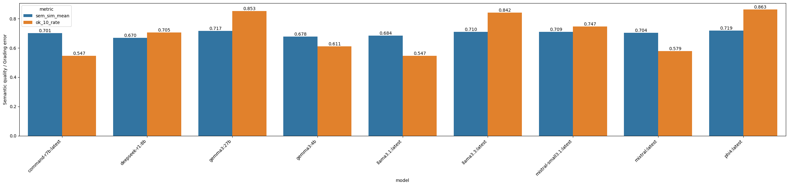

# Evaluation im Projekt Echolearn

Diese Dokumentation beschreibt das Evaluationsvorgehen im Rahmen des Projekts **Echolearn**. Ziel war es, sowohl die Qualität eines Speech-to-Text-(STT)-Modells als auch die Leistungsfähigkeit eines Large Language Models (LLM) als automatischen Prüfungsbewerter („LLM Judge“) systematisch zu untersuchen.

Die Evaluation gliedert sich in drei Teile:

1. `Evalaution des Speech-To-Text Modells`  
2. `Evaluation der LLMs`  
3. `Evaluation der LLMs mit dem Transkript des STT-Modells`  

---

## 1. Evaluation des STT-Modells

### Zielsetzung

In diesem Schritt wurde die Qualität der automatischen Transkription von gesprochenen Prüfungsantworten evaluiert. Ziel war es, zu messen, wie stark die vom STT-Modell erzeugten Transkripte von den ursprünglich intendierten (korrekten) Antworten abweichen.

### Datengrundlage

Die Rohdaten stammen aus der Datei: raw_data_all_evaluation_stt_model.csv

Diese enthält unter anderem:

- `question_de` – Prüfungsfrage auf Deutsch
- `answer_de` – Musterlösung auf Deutsch
- `student_answer` – vom Studierenden formulierte Antwort 
- `human_score` – von menschlichen Korrektoren vergebene Punkte  
- `max_points` – maximal erreichbare Punkte  
- `keywords` - die wichtigen Schlüsselbegriffe der Antwort
- `human_feedback` - das menschlich verfasste Feedback
- `error_type` - Der Fehlertyp beim Transkribieren

Für die STT-Evaluation werden insbesondere folgende Textpaare benötigt:

- Referenztext (originale studentische Antwort)
- STT-Transkript (automatisch erzeugt)

### Evaluationslogik

Die Bewertung des Speech-to-Text-Modells erfolgte über textuelle Ähnlichkeitsmetriken zwischen Referenz und Transkript. Dabei wurde händisch der Fehlertyp annotiert, indem der Referenztext und der Transkript miteinander verglichen wurden. Es wurden vier Fehlertypen definiert, die in der Spalte `error_type` mit den Zahlen 0, 1, 2 und 3 annotiert wurden.
- Fehlertyp `0`: Beim Transkript werden keine Fehler beobachtet
- Fehlertyp `1`: Beim Transkript werden triviale Fehler beobachtet (z.B. dass statt das)
- Fehlertyp `2`: Beim Transkript werden moderate Fehler beobachtet (eine geringe Anzahl an Schlüsselbegriffen wird fehlerfhaft transkribiert)
- Fehlertyp `3`: Beim Transkript wird eine hohe Fehlerrate festgestellt (die meisten Schlüsselbegriffen sind fehlerhaft transkribiert worden)

### Evaluationsprozess

1. Laden der Rohdaten aus der CSV-Datei  
2. Paarweiser Vergleich von Referenztext und STT-Transkript  
3. Annotation des Fehlertyps (0-3)
4. Aggregation der Ergebnisse über alle Antworten hinweg  

### Ziel der Analyse

- Einschätzung der Transkriptionsqualität  
- Identifikation systematischer Fehler (z. B. Fachbegriffe, Abkürzungen)  
- Grundlage für die nachgelagerte Evaluation des LLM Judges  

Die Ergebnisse dienen als Basis für die Frage:  
**Ist die Transkriptionsqualität ausreichend, um darauf automatisierte Bewertung aufzubauen?**

### Ergebnis
Es wurde sich dafür entschieden, Fehlertypen `0` und `1` in die Kategorie `akzeptabel` zu gruppieren. Dies bedeutet, dass mit diesen Fehlern eine automatisierte Bewertung weiterhin möglich ist.
Für Fehlertypen `2` und `3` wurde die Kategorie `nicht akzeptabel` gewählt.
- 64,2% der transkribierten Antworten fallen in die Kategorie `akzeptabel`
- 35,8% der transkribierten Antworten fallen in die Kategorie `nicht akzeptabel`
Das spricht für die weitere Verwendung des STT-Modells

### Beobachtungen
Auch wenn das STT-Modell im Rahmen dieses Projekts verwendet wird, gibt es eine Limitation, die beobachtet wurde: Beim Transkribieren achtet das Modell nicht auf Satzzeichen. Das bedeutet, dass die Texte nicht mit entsprechenden Satzzeichen versehen werden. Bei einer Antowrt, die aus mehreren Sätzen besteht, wurde das nicht unterschieden. Wie später in `3. Evaluation der LLMs mit dem Transkript des STT-Modells` zu sehen ist, verschlechtert dieses Verhalten das Ergebnis.

---

## 2. evaluation_llm_exam_judge

### Zielsetzung

In diesem Schritt wurde untersucht, wie gut ein LLM als automatischer Prüfungsbewerter („Exam Judge“) funktioniert – basierend auf **nicht transkribierten**, also direkt von Menschen verfassten Antworten.

Das LLM erhält hier:

- die Prüfungsfrage unter `question_de`
- die studentische Antwort unter `student_answer` 
- die maximale Punktzahl unter `max_points`
- die Musterlösung für die Prüfungsfrage unter `answer_de`

### Evaluationsdesign

Um die für die spätere Analyse notwendigen Daten zu erhalten, wird das LLM zu folgendem Workflow angewiesen:
1. Er vergleich die studentische Antowrt `student_answer` mit der Musterlösung `answer_de`
2. Er bewertet in Textform die Antwort des Studenten basierend auf folgende Fragen:  
  &ensp;_1) Hat der Student den Sachverhalt fachlich korrekt dargestellt, ohne wesentliche Fehler oder falsche Zusammenhänge?_  
  &ensp;_2) Verwendet der Student die relevanten Schlüsselbegriffe korrekt und im richtigen Kontext?_  
  &ensp;_3) Geht der Student auf alle wesentlichen Aspekte der Fragestellung ein oder bleiben zentrale Punkte unbeantwortet?_  
  &ensp;_4) Werden die angesprochenen Konzepte klar voneinander unterschieden und nicht miteinander vermischt?_  
  &ensp;_5) Ist die Antwort logisch aufgebaut, nachvollziehbar formuliert und für den Prüfer gut verständlich?_  
  &ensp;_6) Soll vom Prüfer eine Rückfrage gestellt werden, um auf Lücken zu prüfen?_
3. Basierend auf der studentischen Antwort, der Musterlösung und den maximal erreichbaren Punkten, vergibt das LLM eine Punktzahl, zwischen 0 und den maximal erreichbaren Punkten. Maximal können **6 Punkte** vergeben werden. Diese automatisch vergebenen Punkte werden anschließend mit den **menschlich vergebenen Punkten (`human_score`)** verglichen.
4. Das LLM entscheidet basierend auf der Vollständigkeit der studentischen Antwort, ob eine Rückfrage erforderlich ist. Dies wird mit den Zahlen 0 bis 3 angegeben, die folgendes bedeuten: 
  &ensp;_`0` bedeutet, dass keine Rückfrage notwendig ist._ 
  &ensp;_`1` bedeutet, dass eine Rückfrage notwendig ist, die sich auf nicht genannte Fach- bzw. Schlüsselbegriffe bezieht._ 
  &ensp;_`2` bedeutet, dass eine Rückfrage gestellt wird und sich auf eine fehlende Teilantwort bezieht._ 
  &ensp;_`3` bedeutet, dass sich die gestellte Rückfrage auf einem Teil der falschen Antwort bezieht._ 

### Vergleichsmetriken

Zur Evaluation der Qualität des LLM Judges wurden folgende Kennzahlen berechnet:

- **Mean Absolute Error (MAE)** zwischen den vom Menschen vergebenen Punkte `human_score` und den vom LLM vergebenen Punkte `llm_rating`
- **Semantic Similarity** zwischen dem menschlichen Feedback `human_feedback` und dem Feedback vom LLM `llm_feebdack`.
Die Berechnung der semantischen Ähnlichkeit erfolgte wie folgt:
- Zunächst wurden die Embeddings von *human_feedback* und *llm_feedback* mit dem Modell `paraphrase-multilingual-MiniLM-L12-v2` von Sentence Transformers berechnet
- Es wurde die Kosinusähnlichkeit zwischen den resultierten Embeddings berechnet und in das DataFrame gespeichert

### Evaluationsprozess

1. Iteration über alle Prüfungsantworten 
2. Übergabe der strukturierten Informationen an das LLM  
3. Extraktion des verfassten Feedbacks und der vergebenen Punktzahl aus der Modellantwort  
4. Vergleich mit dem menschlichen Feedback und Score  
5. Aggregierte statistische Auswertung  

### Ziel der Analyse

- Wie stark stimmt das LLM mit menschlichen Korrektoren überein?  
- Gibt es systematische Abweichungen (z. B. strengere oder mildere Bewertung)?  
- Ist das LLM als automatischer Erstkorrektor einsetzbar?  

### Ergebnis

Wie auf der Grafik zu sehen, werden hier zwei Metriken nebeneinander präsentiert:
- `sem_sim_mean`: Das ist die durschnittliche semantische Ähnlichkeit zwischen *human_feebdack* und *llm_feedback* pro LLM
- `ok_10_rate`: Die Anzahl der Abweichungen zwischem *human_score* und *llm_rating* um 1.0-Punkten
Aus der Grafik lassen sich folgende Top-3 Modelle ablesen:
1. phi4:latest
2. gemma3:27b
3. llama3.3:latest
---

## 3. evaluation_llm_exam_judge_transcript

### Zielsetzung

In diesem Schritt wurde untersucht, wie robust der LLM Judge gegenüber Transkriptionsfehlern ist.  

Im Unterschied zur vorherigen Evaluation erhält das LLM hier **nicht die originalen studentischen Antworten**, sondern die vom STT-Modell erzeugten Transkripte.

Damit wird die realistische Pipeline simuliert:

> Gesprochene Antwort → STT → Transkript → LLM Judge → Bewertung

### Datengrundlage

Die Transkripte stammen aus der STT-Verarbeitung und sind mit den übrigen Metadaten (Frage, Musterlösung, max. Punkte, Human Score) verknüpft.

### Evaluationsdesign

Um die für die spätere Analyse notwendigen Daten zu erhalten, wird das LLM zu folgendem Workflow angewiesen:
1. Er vergleich die transkribierte studentische Antowrt `transkript_stt_model` mit der Musterlösung `answer_de`
2. Er bewertet in Textform die Antwort des Studenten basierend auf folgende Fragen:  
  &ensp;_1) Hat der Student den Sachverhalt fachlich korrekt dargestellt, ohne wesentliche Fehler oder falsche Zusammenhänge?_  
  &ensp;_2) Verwendet der Student die relevanten Schlüsselbegriffe korrekt und im richtigen Kontext?_  
  &ensp;_3) Geht der Student auf alle wesentlichen Aspekte der Fragestellung ein oder bleiben zentrale Punkte unbeantwortet?_  
  &ensp;_4) Werden die angesprochenen Konzepte klar voneinander unterschieden und nicht miteinander vermischt?_  
  &ensp;_5) Ist die Antwort logisch aufgebaut, nachvollziehbar formuliert und für den Prüfer gut verständlich?_  
  &ensp;_6) Soll vom Prüfer eine Rückfrage gestellt werden, um auf Lücken zu prüfen?_
3. Basierend auf der studentischen Antwort, der Musterlösung und den maximal erreichbaren Punkten, vergibt das LLM eine Punktzahl, zwischen 0 und den maximal erreichbaren Punkten. Maximal können **6 Punkte** vergeben werden. Diese automatisch vergebenen Punkte werden anschließend mit den **menschlich vergebenen Punkten (`human_score`)** verglichen.
4. Das LLM entscheidet basierend auf der Vollständigkeit der studentischen Antwort, ob eine Rückfrage erforderlich ist. Dies wird mit den Zahlen 0 bis 3 angegeben, die folgendes bedeuten: 
  &ensp;_`0` bedeutet, dass keine Rückfrage notwendig ist._ 
  &ensp;_`1` bedeutet, dass eine Rückfrage notwendig ist, die sich auf nicht genannte Fach- bzw. Schlüsselbegriffe bezieht._ 
  &ensp;_`2` bedeutet, dass eine Rückfrage gestellt wird und sich auf eine fehlende Teilantwort bezieht._ 
  &ensp;_`3` bedeutet, dass sich die gestellte Rückfrage auf einem Teil der falschen Antwort bezieht._ 

### Vergleichsmetriken

Zur Evaluation der Qualität des LLM Judges wurden folgende Kennzahlen berechnet:

- **Mean Absolute Error (MAE)** zwischen den vom Menschen vergebenen Punkte `human_score` und den vom LLM vergebenen Punkte `llm_rating`
- **Semantic Similarity** zwischen dem menschlichen Feedback `human_feedback` und dem Feedback vom LLM `llm_feebdack`.
Die Berechnung der semantischen Ähnlichkeit erfolgte wie folgt:
- Zunächst wurden die Embeddings von *human_feedback* und *llm_feedback* mit dem Modell `paraphrase-multilingual-MiniLM-L12-v2` von Sentence Transformers berechnet
- Es wurde die Kosinusähnlichkeit zwischen den resultierten Embeddings berechnet und in das DataFrame gespeichert

### Evaluationsprozess

1. Iteration über alle Prüfungsantworten 
2. Übergabe der strukturierten Informationen an das LLM  
3. Extraktion des verfassten Feedbacks und der vergebenen Punktzahl aus der Modellantwort  
4. Vergleich mit dem menschlichen Feedback und Score  
5. Aggregierte statistische Auswertung 

### Zentrale Fragestellung

- Wie stark verschlechtert sich die Bewertungsqualität durch Transkriptionsfehler?  
- Ist das LLM robust gegenüber sprachlichen Unschärfen?  
- Gibt es bestimmte Fehlertypen (z. B. Fachbegriffe), die besonders stark ins Gewicht fallen?

### Ergebnis

Wie auf der Grafik zu sehen, werden hier zwei Metriken nebeneinander präsentiert:
- `sem_sim_mean`: Das ist die durschnittliche semantische Ähnlichkeit zwischen *human_feebdack* und *llm_feedback* pro LLM
- `ok_10_rate`: Die Anzahl der Abweichungen zwischem *human_score* und *llm_rating* um 1.0-Punkten
Im Vergleich zur vorherigen Evaluation sind die Ergebnisse der `sem_sim_mean` hier schlechter, aufgrund der zu Beginn genannten Limitation des STT-Modells. Dennoch lässt sich hier ein Ranking feststellen:
1. mistral-small3.1:latest
2. mixtral:latest
3. phi4:latest

---

# Gesamtergebnis und Fazit

## Gesamtergebnis der Evaluation

Die dreistufige Evaluation im Projekt **Echolearn** erlaubt eine ganzheitliche Betrachtung der automatisierten Bewertung mündlicher Prüfungsleistungen. Dabei wurden sowohl die Qualität der Transkription (STT) als auch die Leistungsfähigkeit verschiedener LLMs als automatischer Prüfungsbewerter unter Ideal- und Realbedingungen untersucht.

### 1. Bewertung des STT-Modells

- 64,2 % der Transkripte wurden als **akzeptabel** (Fehlertyp 0 oder 1) eingestuft.
- 35,8 % wurden als **nicht akzeptabel** (Fehlertyp 2 oder 3) klassifiziert.
- Hauptlimitation: fehlende Satzzeichen und teilweise fehlerhafte Transkription von Schlüsselbegriffen.

Trotz dieser Limitation wurde das STT-Modell als ausreichend leistungsfähig eingestuft, um in einer automatisierten Bewertungspipeline eingesetzt zu werden. Die Fehlerquote ist relevant, aber nicht so hoch, dass eine Weiterverarbeitung durch ein LLM grundsätzlich unmöglich wäre.

---

### 2. Evaluation der LLMs mit Originalantworten

Unter Idealbedingungen (direkt vom Menschen verfasste Antworten) zeigte sich:

- Hohe semantische Ähnlichkeit zwischen menschlichem und LLM-Feedback bei den Top-Modellen.
- Geringe mittlere absolute Abweichung (MAE) zwischen `human_score` und `llm_rating`.
- Konsistente Rangfolge der leistungsstärksten Modelle.

**Top-3 Modelle (Originalantworten):**

1. `phi4:latest`  
2. `gemma3:27b`  
3. `llama3.3:latest`  

`phi4:latest` überzeugte insbesondere durch:
- Gute Übereinstimmung mit menschlichen Punktvergaben  
- Hohe semantische Nähe im Feedback  
- Stabilität über verschiedene Antworttypen hinweg  

---

### 3. Evaluation der LLMs mit STT-Transkripten

Unter realistischen Pipeline-Bedingungen (STT → LLM) zeigte sich:

- Ein Rückgang der semantischen Ähnlichkeit (`sem_sim_mean`)
- Eine leichte Verschlechterung der Punktgenauigkeit
- Größere Sensitivität gegenüber Transkriptionsfehlern

**Top-3 Modelle (Transkripte):**

1. `mistral-small3.1:latest`  
2. `mixtral:latest`  
3. `phi4:latest`  

Obwohl sich das Ranking verschob, blieb `phi4:latest` weiterhin unter den leistungsstärksten Modellen und zeigte insgesamt eine robuste Performance – auch bei verrauschten Eingaben.

---

## Gesamtbewertung der Pipeline

Die kombinierte Betrachtung aller drei Evaluationsschritte zeigt:

- Das STT-Modell liefert in der Mehrheit der Fälle verwertbare Transkripte.
- LLMs sind grundsätzlich in der Lage, Prüfungsleistungen automatisiert zu bewerten.
- Transkriptionsfehler wirken sich messbar auf die Bewertungsqualität aus.
- Dennoch bleibt die Gesamtperformance auf einem praktikablen Niveau.

Besonders relevant ist, dass kein Modell ausschließlich unter Idealbedingungen überzeugte, sondern auch Robustheit gegenüber realistischen Eingaben zeigen musste.

---

# Entscheidung für `phi4:latest`

Auf Basis der Evaluationsergebnisse wurde das Modell **`phi4:latest`** für die Anwendung in Echolearn ausgewählt.

### Begründung der Modellwahl

1. **Beste Gesamtperformance unter Idealbedingungen**  
   - Höchste semantische Ähnlichkeit zum menschlichen Feedback  
   - Sehr geringe Abweichung in der Punktvergabe  

2. **Robuste Performance unter Realbedingungen**  
   - Auch mit STT-Transkripten weiterhin unter den Top-Modellen  
   - Keine drastische Performance-Degradation  

3. **Praktische Eignung für Echolearn**  
   - Verlässliche Punktvergabe  
   - Nachvollziehbares, strukturiertes Feedback  
   - Gute Skalierbarkeit für den produktiven Einsatz  

---

# Fazit

Die Evaluation zeigt, dass eine automatisierte Bewertung mündlicher Prüfungsleistungen technisch realisierbar ist.

Zentrale Erkenntnisse:

- Die Qualität der Transkription ist ein entscheidender Faktor für die Gesamtperformance.
- LLMs können menschliche Bewertungen in vielen Fällen mit hoher Übereinstimmung approximieren.
- Eine sorgfältige Modellwahl ist essenziell, da sich Modelle unterschiedlich sensitiv gegenüber Transkriptionsfehlern zeigen.

Mit der Entscheidung für **`phi4:latest`** wurde ein Modell gewählt, das sowohl unter Ideal- als auch unter Realbedingungen eine stabile und leistungsfähige Bewertung ermöglicht.

Damit stellt Echolearn eine praktikable Grundlage für die automatisierte Unterstützung mündlicher Prüfungsformate dar – mit klar identifizierten Verbesserungspotenzialen im Bereich der Transkription und strukturellen Textaufbereitung.